## Java Book 2 Setup

### Eclipse Working Sets
*Working sets* allow us to organize the projects we see in Eclipse's Project Explorer.  A project can be tagged as belonging to one or more working sets.  When we choose *Working Sets* as the top-level elements displayed by Project Explorer, we can expand or collapse the working sets to see or hide their lists of projects.

#### Configuring Working Sets

##### Create working sets and add projects to them.

1. Find the Package Explorer view menu (the tiny triangle drop-down menu at the upper right of the view.)

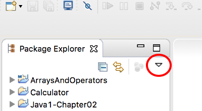

2. Choose *Select Working Set...*.

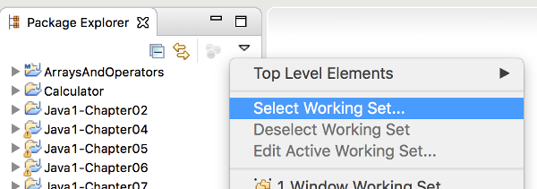

3. Create a *New* working set.

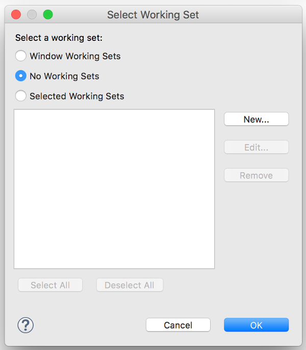

4. Choose *Java* as the working set type.

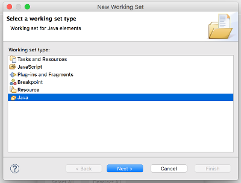

5. Name the working set

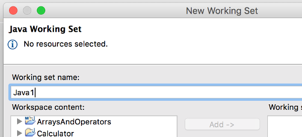

6. Choose projects to belong to this new working set (you can add or remove projects from the working set later) ...

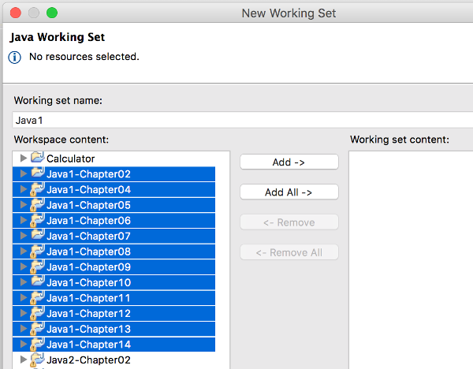

... and add them to the working set:

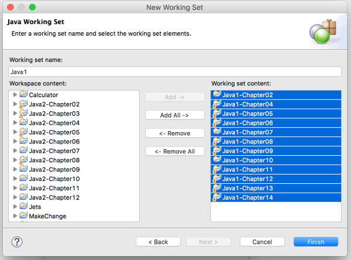

Click *Finish*.

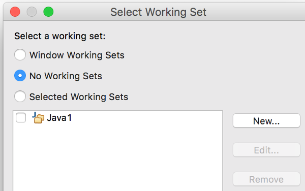

7. Now select your new working set so it will be displayed.

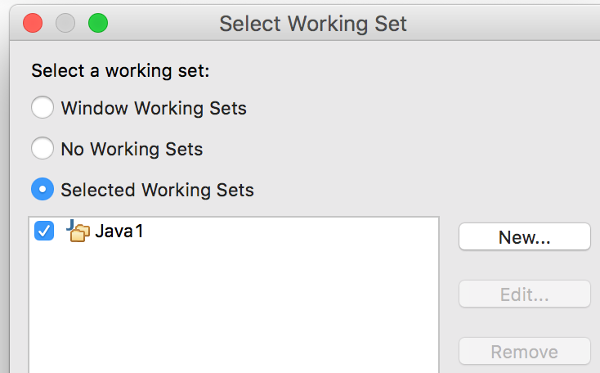

8. Create working other working sets, and add the rest of your projects to them.

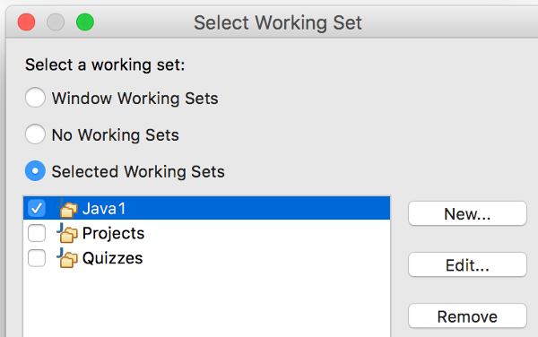

**BE SURE YOU SELECT ALL THE WORKING SETS TO BE DISPLAYED**

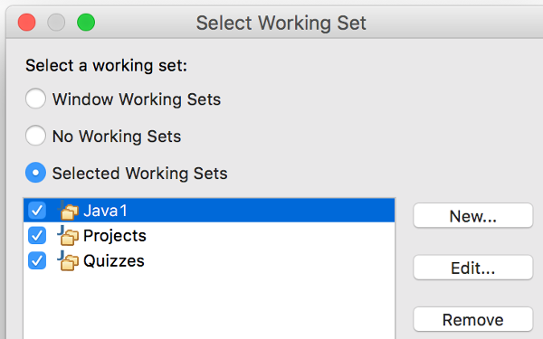

##### Set top-level elements to *Working Sets*

1. In the Project Explorer menu, go to *Top-Level Elements* and choose *Working Sets*.

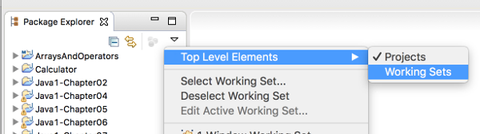

2. You can now expand and collapse the working sets to make the explorer easier to navigate.  Any projects not added to one of your working sets can be found in **Other Projects**.

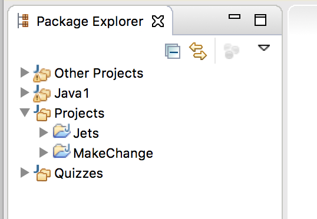

### Eclipse Import Course Files

1. Create a new working set, *Java2*.  Don't add any projects to it. Make sure to select it for display.

2. In Package Explorer, select Java2.

3. Go to *File* | *Import...* | *Existing Projects into Workspace*

4. Choose *Select archive file* and *Browse* to the java2.zip you downloaded.  You should see the chapter projects listed for import.  At the bottom of the dialog, *Add to working sets* should show *Java2*.

5. Finish.
