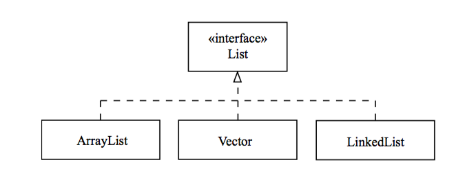

## The List Interface

* One of the collection types defined in the `java.util` package is `List`.

  * `List` guarantees insertion-order; the order you add elements into a list is the same order that you will iterate through them.

  * `List` allows duplicate elements.

* Use the `size()` method to determine the number of elements in the `List`.

* Use the `add(element)` method to add an element to the end of the `List`.

* `List` also provides methods for indexed access to the list elements.

  * `add(index, element)` inserts an element into a specific position within the `List`.

  * `set(index, element)` overwrites an element at the specific position within the `List`.

  * `get(index)` retrieves an element from a specific position within the `List`.

  * All indexing is zero-based.

* `List` is an interface.

  * You will actually instantiate one of its implementing classes like `ArrayList`, `Vector`, or `LinkedList`.

  ```java
  List<String> myList = new ArrayList<>();
  
  ```



<hr>

[Prev](Collections.md) | [Up](../README.md) | [Next](ListImplementationClasses.md)

