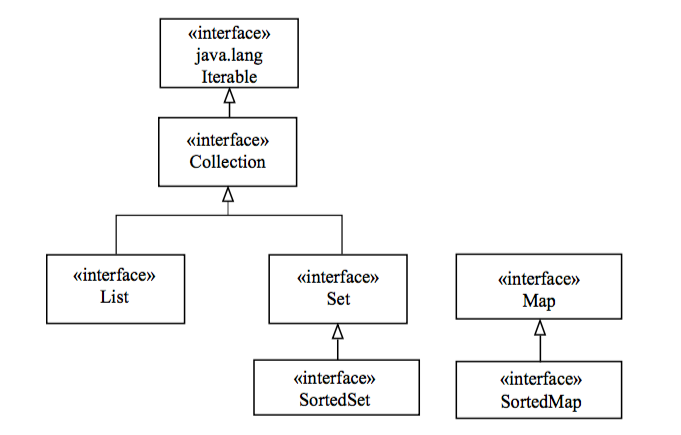

## The Collections Framework

* A *collection* is an object that contains other objects.

  * The size of a collection can be altered after creation.

  * Some collection types order elements, while others do not.

* Interfaces and classes related to collections make up the *Java Collections Framework*.

* Interfaces determine common behavior or characteristics of various collection types.

  * `Collection` is the parent interface of `Set` and `List`.

    * The `Set` interface describes a group of unique elements.

    * The `List` interface describes an ordered group of elements.

  * The `Map` interface describes a group of key/value pairs, the keys being unique.

* Abstract classes aid in the implementation of the interfaces.

* Developers use implementation classes, including `HashSet`, `ArrayList`, and `HashMap`.

  * Legacy collections, such as **Vector**, are still supported.

* Use the `Iterator` interface to access collection elements sequentially.

#### Background

Prior to Java 2, Java provided a few basic container classes that all remain in the Java API. The `Hashtable`, `Properties`, `Stack`, and `Vector` classes have been retrofitted into the current Collections Framework. While `Enumeration` is still supported, developers are encouraged to use the `Iterator` interface for sequential access to collection elements. Consider the abstract class `Dictionary` obsolete in favor of the `Map` interface. No changes were made to `BitSet`.

All interfaces are members of the `java.util` package, unless otherwise noted.

[Prev](README.md) | [Up](../README.md) | [Next](TheSetInterface.md)

