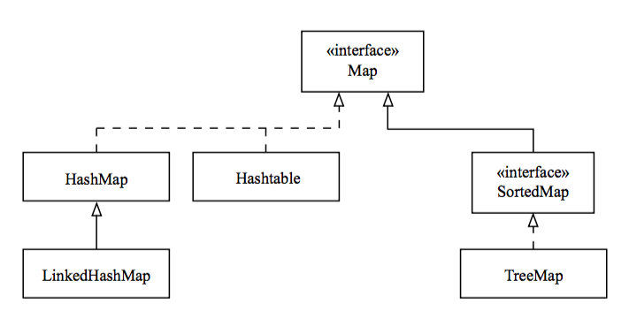

## The Map Interface

* `Map`s allow you to store key/value pairs.

  * The key must be unique.

  * A key can map to only a single value.

* The `Map` interface makes no guarantees about order.

* Use `Map`'s methods to work with the `Map`.

  * The `put(key, value)` method adds a key/value pair to the `Map`.

  * The `get(key)` method returns the value associated with the given key.

  * The `containsKey(key)` and `containsValue(value)` methods return `true` if the given parameter is in the `Map`.

* `Map` does not define an `iterator()` method.

  * Use the `keySet()` method to retrieve a `Set` of keys that you can then iterate on.

  ```java
  Set<String> s = myMap.keySet(); 
  Iterator<String> it = s.iterator();
  
  while (it.hasNext()) {
    String key = it.next();
    System.out.print("Key: " + key); 
    System.out.println(" Value: " + myMap.get(key));
  }
  ```

<hr>



[Prev](TheCollectionsFramework.md) | [Up](../README.md) | [Next](MapImplementationClasses.md)

