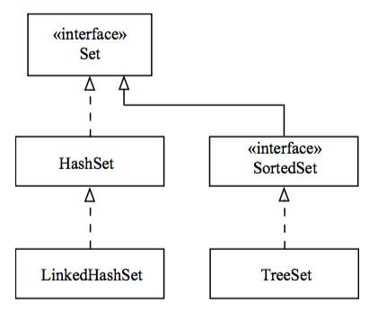

## The Set Interface

* **Set**s are not allowed to store duplicate elements.

  * No two elements in a **Set** can be `equal()` to each other.

  * At most, one `null` element may be placed in a **Set**.

    * Some implementations may disallow `null` elements.

* Use the `add(element)` method to add an element to the **Set**.

  * The returned `boolean` may be used to determine whether a unique element was added.

    * `true` indicates the added element did not already exist in the **Set**.

    * `false` indicates that the **Set** was left unchanged because the element
already existed.

* Use the `iterator()` method to retrieve an **Iterator** object which you can use to step through a **Set**.

  * Use `hasNext()` to determine if there are more elements in a collection.

  * Use `next()` to then retrieve the next element.

  ```java
  Iterator<String> it = myset.iterator(); 
  
  while (it.hasNext()) {
    System.out.println(it.next()); 
  }
  ```

* The **SortedSet** interface adds the guarantee that the **Set** will be ordered.



<hr>

[Prev](TheCollectionsFramework.md) | [Up](../README.md) | [Next](SetImplementationClasses.md)

