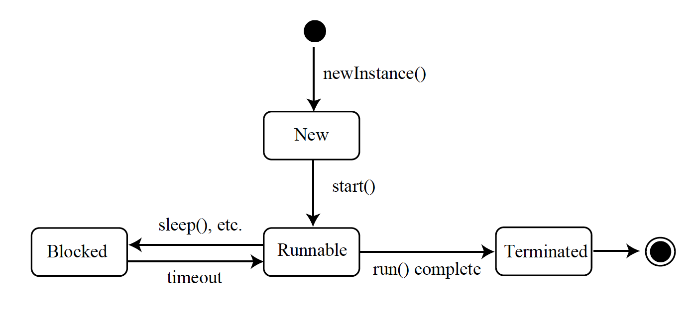

## Thread States

* A thread’s state is defined by what has been done to it or what it is trying to do.

* A thread is in a new state after it has been created, but before it has been sent a `start()` message.

```java
Thread t1 = new Thread();
```

* A thread is in a terminated (dead) state after it has completed its run().

* A thread is in a blocked state when it is waiting for some condition to be met.

  * A thread that is waiting on I/O is blocked until the action occurs.

  * A thread that is sleeping is blocked for a specified amount of time.

  * A thread that is waiting for another thread to finish or to release a resource is also blocked.

* A thread is in a runnable state if:

  * It has been sent a `start()` message.

  * It is not terminated.

  * It is not blocked.

* A runnable thread is not necessarily a "running" thread.

<hr>



Beginning in Java 5, the blocked state is broken into three sub-states: **Waiting**, **Timed_Waiting**, and **Blocked**.

[Prev](NonThreadedApplications.md) | [Up](../README.md) | [Next](RunnableThreads.md)

