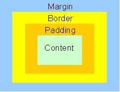

## Headings
  Headings are used to delineate content titles. The `<h1>` - `<h6>` tags define header elements from largest to smallest.

Code:
```html
    <h1>This is a H1 header</h1>
    <h6>This is a H6 header</h6>
```

Rendered:
<h1>This is a H1 header</h1>
<h6>This is a H6 header</h6>

### Paragraphs
  Paragraphs are used to insert content blocks of text.

Code:
```html
  <p>This is a paragraph section</p>
  <p>This is another paragraph section</p>
```
Rendered:
<p>This is a paragraph section</p>
<p>This is another paragraph section</p>

### Semantics
  Inside of text content you can use some semantic tags to alter the way text is rendered. `<em>`, `<strong>` are some examples:

Code:
  ```html
    <p><em>This is a emphasized paragraph</em></p>
    <p><strong>This is a strong paragraph</strong></p>
  ```
Rendered:
<p><em>This is a emphasized paragraph</em></p>
<p><strong>This is a strong paragraph</strong></p>

### Breaks
  You can use break statements to insert an empty line for some formatting.

Code:
  ```html
    <p>First paragraph</p>
    <br>
    <p>Second paragraph</p>
  ```
Rendered:
<p>First paragraph</p>
<br>
<p>Second paragraph</p>

### Horizontal Rules
  You can use horizontal rule statements to insert a horizontal line for some formatting.

Code:
  ```html
    <p>First paragraph</p>
    <hr>
    <p>Second paragraph</p>
  ```

Rendered:
<p>First paragraph</p>
<hr>
<p>Second paragraph</p>

### Links

Links can be used to navigate to different URL's in your page. You can define the location where the link navigates to with the href property. The text you put inside of the `<a>` tag is what the link will say on the page.

Code:
```html
<a href="https://www.google.com/">this is what the link says</a>
```
Rendered:
<a href="https://www.google.com/">this is what the link says</a>

### Images

Images can be added to an HTML document with an `` tag. The tag takes a single attribute src that is a path to the images location.

Code:
```html

```

Rendered:
<br>


### Lists
List are used to display grouped content. Unordered lists will render with the classic bulleted style, while ordered list will give you numbered elements.

#### Unordered Lists
Code:
```html
  <ul>
    <li>bullet 1</li>
    <li>bullet 2</li>
    <li>bullet 3</li>
  </ul>
```

Rendered:
<ul>
  <li>bullet 1</li>
  <li>bullet 2</li>
  <li>bullet 3</li>
</ul>   

#### Ordered Lists
Code:
```html
  <ol>
    <li>item 1</li>
    <li>item 2</li>
    <li>item 3</li>
  </ol>
```

Rendered:
<ol>
  <li>item 1</li>
  <li>item 2</li>
  <li>item 3</li>
</ol>  

[Prev](3_htmlAttributes.md) | [Up](../README.md) | [Next](5_htmlForms.md)
