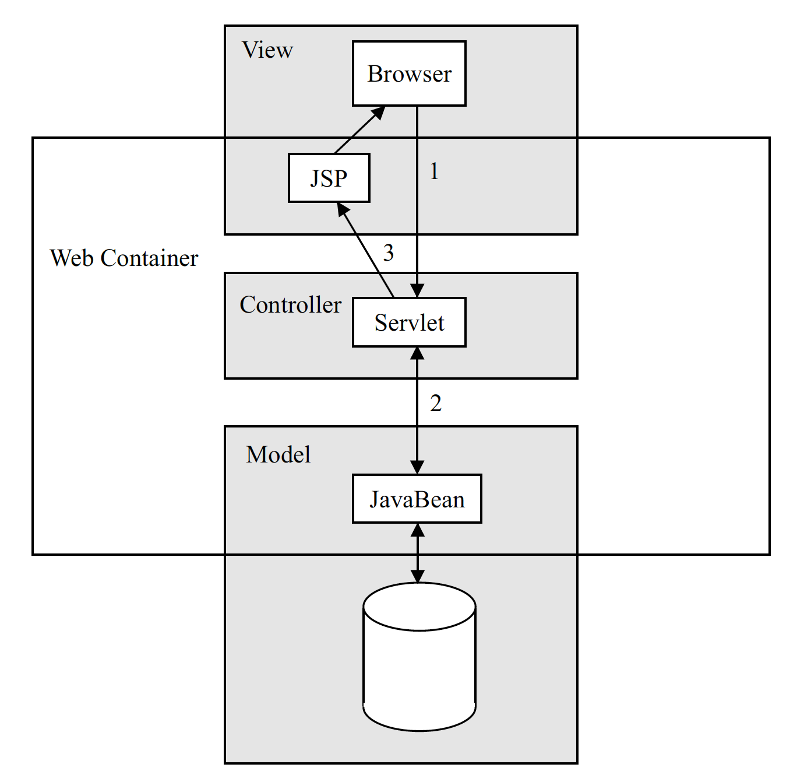

## MVC and Web Applications

* The Model-View-Controller (MVC) architecture was originally created to separate user interface code (the view) from domain code (the model).

  * The controller was introduced as a separate body of code that manages the translation of events in the view to methods in the model.

  * The view only accesses the model to retrieve values for display.

  * The model should not have any knowledge of the view or the controller.

* For web applications, use JavaBeans to define the model.

  * A JavaBean is simply a Java class with a no-arg constructor and get/set methods.

  * The controller should encapsulate business object data in JavaBeans to make the data accessible to the JSP views.

* Use a servlet as the controller.

  * It will extract data needed to handle the request from the browser.

  * The servlet will also call methods on JavaBeans to process the request.

  * Finally, it will forward the request to the JSP page, including any beans needed to generate the view.
  
    * The servlet might choose between JSP pages based on the results of the request.

* Use JSP pages to generate the view.

  * The view will retrieve information to display from the beans included by the servlet.

The benefits of MVC are similar to encapsulation. Changes in the model can be made without impacting the view. The view can be modified, or new views can be implemented without impacting the model.  Developers can focus on their skills — database programmers do not need to understand user interface issues.

In the early days of JSP, the popular architecture was what is now referred to as "Model 1." In this architecture, a browser request is handled directly by a JSP file, which, in turn, creates JavaBeans to access the business objects. The more modern architecture described above is referred to as the "Model 2" architecture.

In both Model 1 and Model 2 architectures, JavaBeans are the preferred mechanism for accessing business objects. The JSP specification has strong support for working with JavaBeans objects, which makes it easier to separate the display logic of the JSP file from the business logic of the application.

[Prev](README.md) | [Up](../README.md) | [Next](02-IntroJSP.md)
