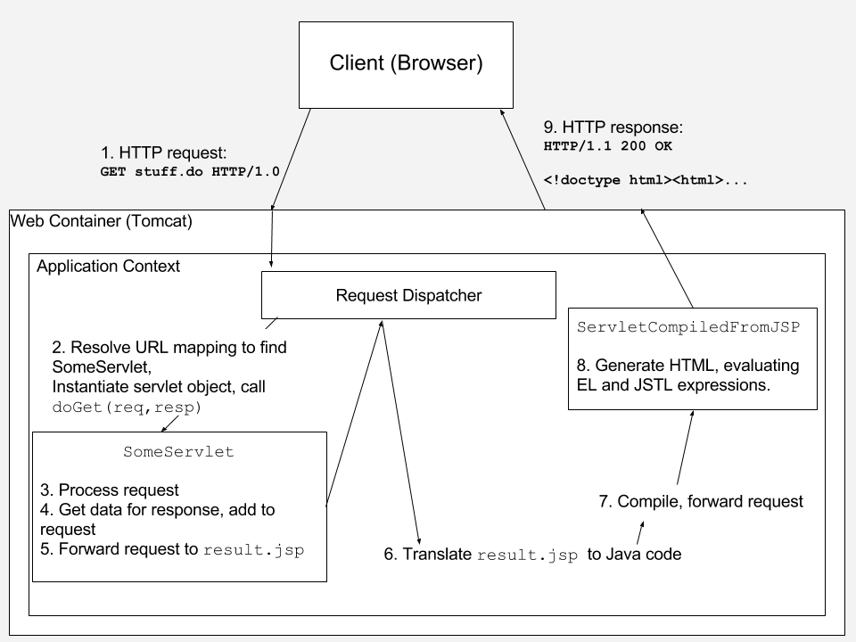

## Introduction to JSP

* JavaServer Pages (JSP) allows web developers to create dynamic content by combining HTML with JSP elements.

  * The simplest JSP looks just like HTML.

  * JSP elements are processed by the web container, not by the client browser.

  * Anything within your JSP page that is not a JSP element will be handled by the browser.

* Your initial request for a JSP page from your browser will result in a series of steps on the server:

  * The web container loads the JSP and dynamically translates it into a Java servlet.

  * The generated servlet is compiled into a .class file.

  * The web container executes the servlet's service() method in its own thread to generate the response back to the browser.

[Prev](01-MVCWebApps.md) | [Up](../README.md) | [Next](03-ExpressionLanguage.md)

