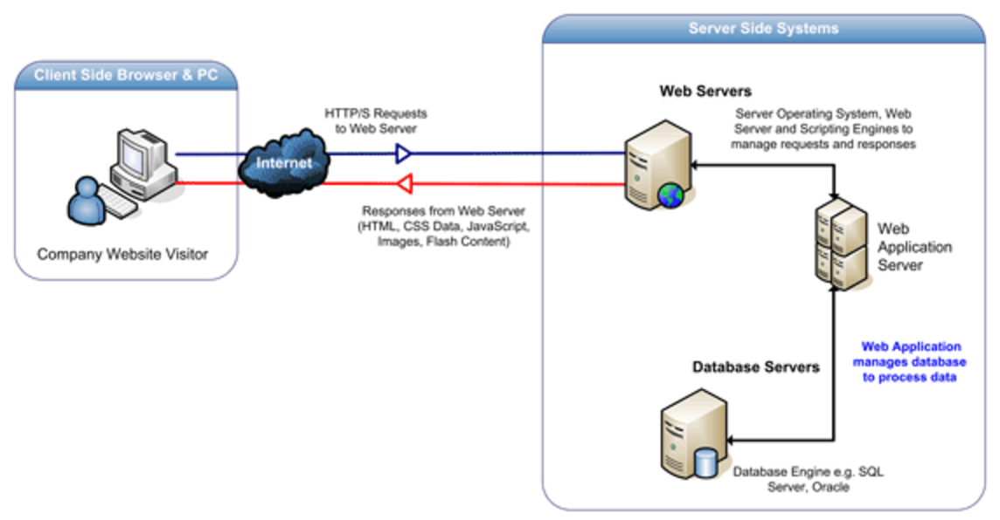

## Java Web Programming

We are starting to enter the world of Java web applications. Over the course of the next few weeks we will introduce you to a variety of technologies that aid in the creation of a dynamic web app. In JWeb we will look at using JavaServer Pages as well as Servlets to display information in a web browser. Below is a brief overview of these technologies as well as a few additional resources that may aid in your understanding of these technologies.

### Objectives

* Write web applications that combine Java Servlets, JavaServer Pages, and JavaBeans using the Model-View-Controller architecture.

* Use JavaBeans to encapsulate business and data access logic.

* Generate HTML output with JavaServer Pages.

* Process HTTP requests with Java Servlets.

* Configure your web applications with the web.xml deployment descriptor.

* Store user specific data in an HttpSession object.

### Topics
  * Course Introduction
  * [Web Applications](WebApplications/README.md)
  * [Java Servlets](Servlets/README.md)
  * [JavaServer Pages (JSP)](JSP/README.md)
  * [Session and Application Scope](Scope/README.md)

### Project
  *  [Group Project](../Presidents-Project/README.md)

### Course Introduction

#### What are Web Applications?
Web applications are a collection of resources that comprise a website. Users can access and submit data to or from a database via a web browser. Our Java web apps will be comprised of Servlets, JavaServer Pages (JSPs), and supporting files. These files are managed by an application server, which for our purposes will be Apache Tomcat, that provides a sever environment for them to run in.

#### What are Servlets?
A servlet is a component of our web application that usually communicates using HTTP protocol. The servlet receive requests from the browser and constructs an appropriate HTML response.

#### What are JSPs?
JavaServer Pages or JSPs are documents consisting of HTML as well as embedded Java code. At runtime JSPs are compiled into servlets. Modern JSPs have adopted additional functionality in the form of an Expression Language (EL) and the JSP Standard Tag Library (JSTL).

#### Additional Resources
* [Java Servlet Technology](http://www.oracle.com/technetwork/java/index-jsp-135475.html)
* [JSP Technology](http://www.oracle.com/technetwork/java/jsp-138432.html)
* [JSTL Technology](http://www.oracle.com/technetwork/java/jstl-137486.html)
* [Java EE 6 Tutorial](http://download.oracle.com/javaee/6/tutorial/doc/)
* [Web Applications][wikiWebApp]
* [Oracle Servlet Docs][oracle]
* [Servlets][wikiServlet]
* [JSPs][wikiJSP]

[oracle]: http://docs.oracle.com/javaee/6/tutorial/doc/bnafd.html
[wikiServlet]: https://en.wikipedia.org/wiki/Java_servlet
[wikiWebApp]: https://en.wikipedia.org/wiki/Web_application
[wikiJSP]:https://en.wikipedia.org/wiki/JavaServer_Pages

