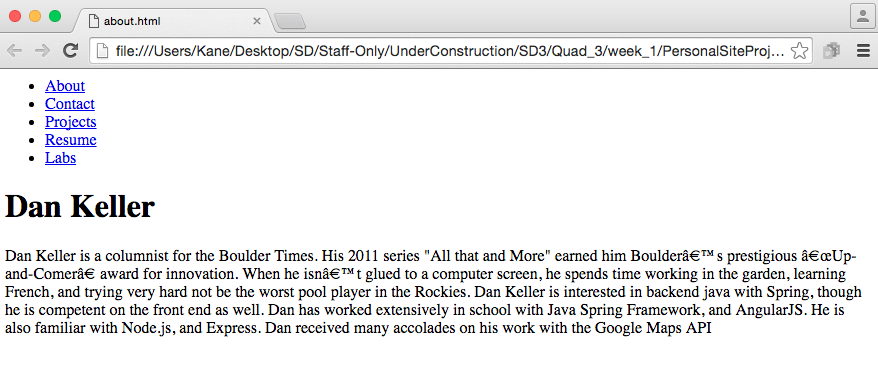
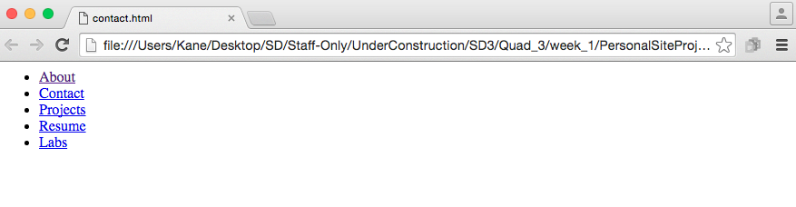

## Step 2 - Basic navigation

### Overview
We're going to create a navigation menu to four other pages, "Contact", "Projects", "Resume", "Labs". They'll be empty for now except for the navigation menu copied between each of the files. `<a> <ul> <li>`  
  
### User Stories
##### User Story #1
Create four well formed html documents:
* contact.html
* labs.html
* resume.html
* projects.html  
  
##### User Story #2
Title each file appropriately.

##### User Story #3
In 'index.html' create a list of links to each of the pages (including 'about.html').  
  

##### User Story #4
Copy the list of links to each of the other pages (this is serving as your nav bar for the time being).  
  

[Prev](../Step1/README.md) | [Up](../README.md) | [Next](../Step3/README.md)
