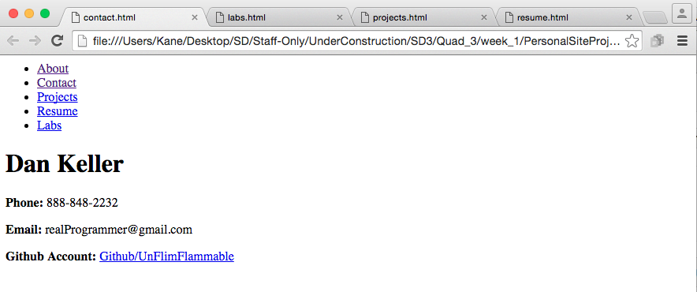
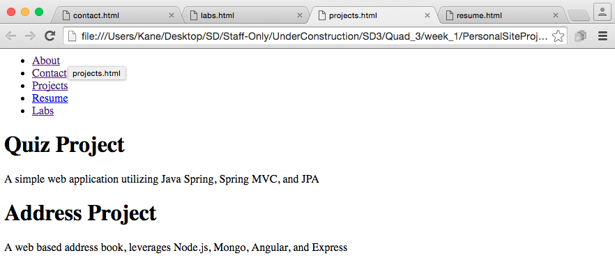
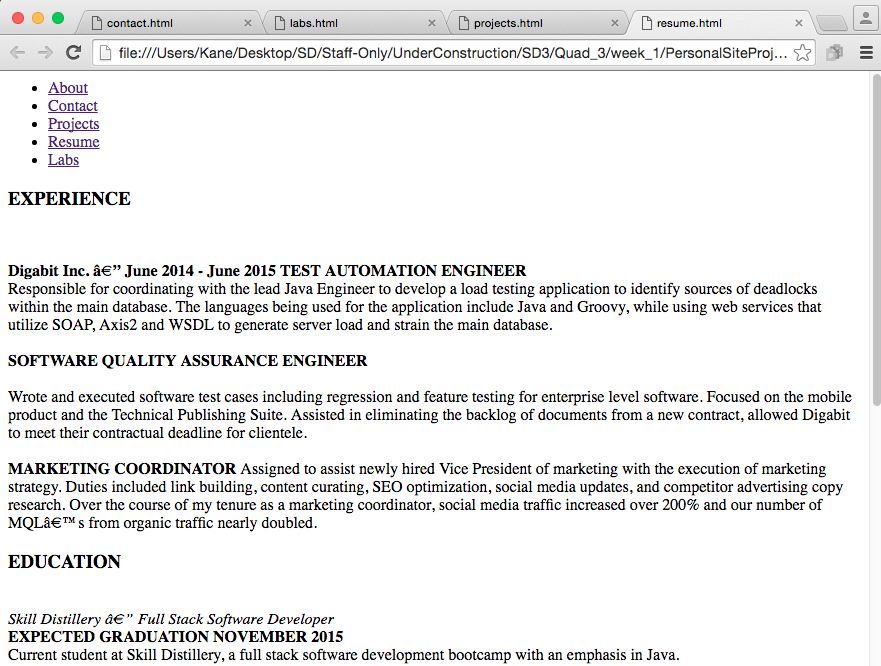
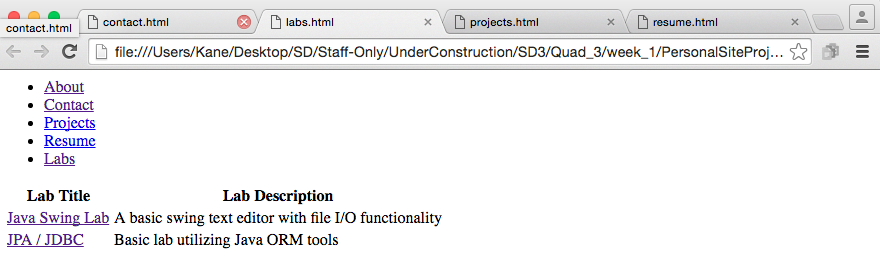

## Step 3 - Frame out content pages

### Overview
You are going to fill out the other pages. Content is integral to any website, no one wants to stare at an empty page.

### User Stories
##### User Story #1
Add some contact information to your site. If you are uncomfortable putting your phone number of personal email online, just put your github account info for now, maybe twitter.  
  

##### User Story #2
This would be a good spot to link to your quiz project (or any project for that matter).  Make sure that the project is up to date on github, and link to the source code. If you have it hosted on your EC2 instance, link to the production code as well. Don't forget to include information about how you built it, what tech you used, how to use it, what it's purpose is etc etc.  
  

##### User Story #3
You are probably going to want to track down a job after Skill Distillery, you can make it easier for potential employers to check you out by posting resume info on your site. If you don't want to post you contact info that's fine, but list your work experience, skills, education etc.  

##### User Story #4
(Optional) This is a good oppotunity to get more practice with Github as well as HTML. Push a lab or two that your are proud of up to Github (maybe your caesar cipher?). Link to it, and give a run down of what it is, how to use it and how you built it.
  

[Prev](../Step2/README.md) | [Up](../README.md) | [Next](../Step4/README.md)
