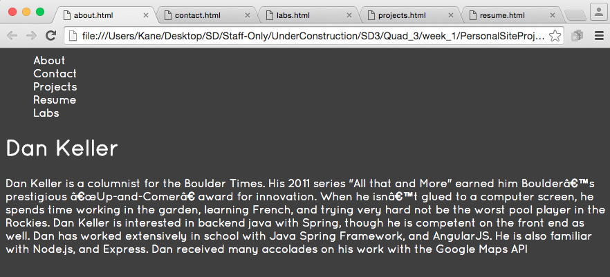

## Step 4 - Add some basic styling

### Overview
Basic Styling of the pages such as fonts, background color, text sizing etc.  
  

### User Stories
Remember to use an external stylesheet, you should not use any inline styles.

##### User Story #1
Pick a custom font from google fonts. Set your text elements to that font. 

##### User Story #2
Pick a custom background color for your website, and color elements accordingly.

##### User Story #3
Set the menu elements to change color on hover, add a border on hover.

##### User Story #4
Place a table in Labs with two columns: 'Lab Title', 'Lab Description'. The Elements in the 'Lab Title' column should be wrapped in anchor tags and link to the lab's Github page.  `<table> <tr> <td>`

[Prev](../Step3/README.md) | [Up](../README.md) | [Next](../Step5/README.md)
