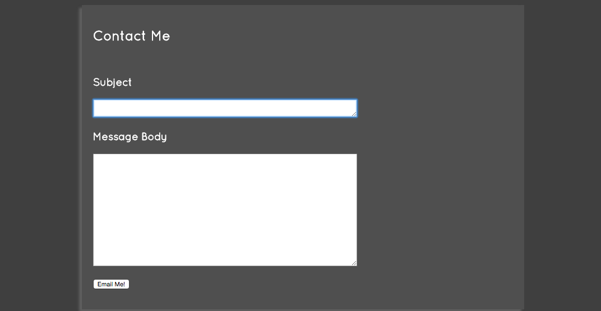

## Step 6 - Add a contact form

#### Overview
Expand your contact page to include a form. The form should have fields for a subject, body, and a submit button. Use a `mailto` action with a form so that when the submit is clicked submit a mailto: link containing the subject and body of the email.  `<form> <input>`  
  
  
  
### User Stories
##### User Story #1
Create a form with a subject field, a body text area and a 'send' button.

##### User Story #2
When the 'send' button is pressed, use a mailto action to have the user's default mail client open and be prepopulated with an email address, as well as contain the subject and body text.

##### User Story #3
Use what you learned today to style the form in a manner that matches the design of your site.

[Prev](../Step5/README.md) | [Up](../README.md) | [Next](../Step7/README.md)
