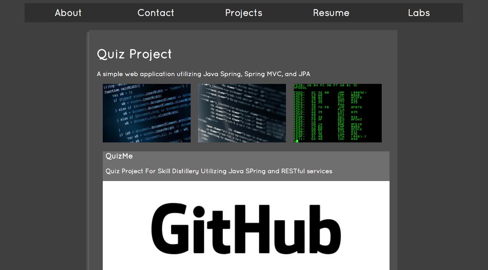

## Step 7 - Link projects and images

### Overview
Now you'll flesh out your projects page with some screen shots and images of your project in action.
  
### User Stories
##### User Story #1
Take at least one screen shot of the index (home) page of your project. Take at least two additional screenshots of various parts of your project that your find interesting, and one of a part of the code that composes your project.

##### User Story #2
Remember the image gallery we did? Display the three images inline and link them to your project.

##### User Story #3
Below the inline images place the screen shot you took of your code, link this one to Github.

[Prev](../Step6/README.md) | [Up](../README.md)
