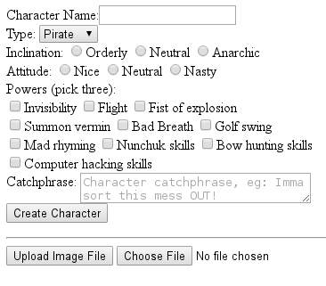

## HTML Forms
* An HTML form provides a mechanism for accepting user input in a browser and, when activated, generating and sending a query request to the web server.
  * The web server typically invokes a separate program or script (named by the form's `action` attribute) to handle the query and generate the HTML content of the response.
* A web page can contain any number of forms.
  * Each form is enclosed in `<form></form>` tags.
  * A form name attribute can help both client-side JavaScript and server-side code distinguish between forms on a page.
* HTML form elements provide familiar user-interface components.
  * Simple inputs like text fields, buttons, drop-down lists, checkboxes, and radio button groups.
  * More complex widgets like file selectors, date and color choosers, etc.
  * Hidden elements, often used to cache data in a multi-form sequence.
* Each form element has a name and a value.
  * An element can have multiple values.
  * The browser sends each element's name and value to the server when the form is activated.
  * The server passes these *name=value* pairs to the server-side program designated by the form's `action`.

<hr />


```html
<form name='character_details' method='POST' action='http://example.com/char.cgi'>
 <label>Character Name:<input type="text" name='character_name'></label><br />
 <label>Type: <select name='character_type'>
                <option value="pir">Pirate</option>
                <option value="nin">Ninja</option>
                <option value="zom">Zombie</option>
                <option value="rob">Robot</option>
              </select></label><br />
 <label>Inclination:
  <label><input type='radio' name='inclination' value='orderly'>Orderly</label>
  <label><input type='radio' name='inclination' value='neutral'>Neutral</label>
  <label><input type='radio' name='inclination' value='anarchic'>Anarchic</label>
 </label><br />
 <label>Attitude:
  <label><input type='radio' name='attitude' value='nice'>Nice</label>
  <label><input type='radio' name='attitude' value='neutral'>Neutral</label>
  <label><input type='radio' name='attitude' value='nasty'>Nasty</label>
 </label><br />
 <label>Powers (pick three):<br />
  <label><input type='checkbox' name='power' value='invisibility'>Invisibility</label>
  <label><input type='checkbox' name='power' value='flight'>Flight</label>
  <label><input type='checkbox' name='power' value='fistOfExplosion'>Fist of explosion</label> <br />
  <label><input type='checkbox' name='power' value='summonVermin'>Summon vermin</label>
  <label><input type='checkbox' name='power' value='badBreath'>Bad Breath</label>
  <label><input type='checkbox' name='power' value='golfSwing'>Golf swing</label> <br />
  <label><input type='checkbox' name='power' value='madRhyming'>Mad rhyming</label>
  <label><input type='checkbox' name='power' value='nunchukSkills'>Nunchuk skills</label>
  <label><input type='checkbox' name='power' value='bowHuntingSkills'>Bow hunting skills</label> <br />
  <label><input type='checkbox' name='power' value='computerHackingSkills'>Computer hacking skills</label>
 </label><br />
 <label>Catchphrase:
  <textarea name='catchphrase' rows='2' cols='30'
            placeholder='Character catchphrase, eg: Imma sort this mess OUT!'
            style='vertical-align:top'></textarea>
 </label><br />
  <input type='hidden' name='player_level' value='1' />
 <button name='create_character' value='Create'>Create Character</button> <br />
</form>
<hr />
<form name='avatar_upload' method='POST' action='http://example.com/char.cgi'
      enctype="multipart/form-data">
 <button name='upload_avatar' value='Upload'>Upload Image File</button>
 <input type='file' name='avatarfile' accept='image/*' /><br />
</form>
```

[Prev](HTTPStatusCodes.md) | [Up](../README.md) | [Next](HTMLFormActivation.md)

