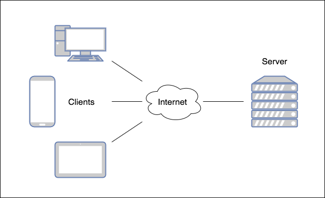

## Internet Basics
The Internet is a global network of billions of computers or other electronic devices. The pieces of this network are connected by physical cables, such as copper telephone wires, TV lines, and fiber optic cables, which span the entire globe - below or above ground, and across the ocean floor. Even wireless connections, such as Wi-Fi, ultimately rely on these cables.

At its simplest, the Internet exists to carry data, 0's and 1's, from one place to another.

### Clients and Servers
Much of the Internet is uses a **client-server** model. **Clients** are devices that request data from a resource or service. **Servers** are the locations of those resources or services.

Web browsers (Chrome, Firefox) and web applications (SnapChat) are examples of clients.

Data transfer starts with the client. The client initiates communication with a server by making a **request** for the server's content or service function. The server then **handles** the request and returns a **response**, such as a Web page.

(This is different than a **Peer-to-Peer** (P2P) model where all devices are considered peers, and thus communicate with each other directly to share resources and services.)

Since the data is always 0's and 1's, clients and servers must use **Protocols** to understand how to communicate.

### Protocols
Protocols are rules for how the members of a network present and read data - in other words, speak the same language.

Protocols can exist at several levels in a connection. For example, there are protocols that allow hardware to transfer data between devices, and protocols for the exchange of data between programs running on those devices. The devices on each side of the connection know how to interpret the 0's and 1's of data.

We will learn about the [Hypertext Transfer Protocol](HTTP.md), which drives the [World Wide Web](WorldWideWeb.md).

[Prev](README.md) | [Up](../README.md) | [Next](WorldWideWeb.md)
