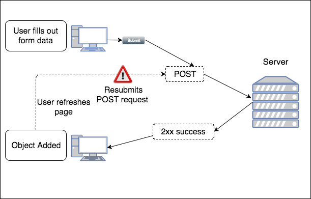
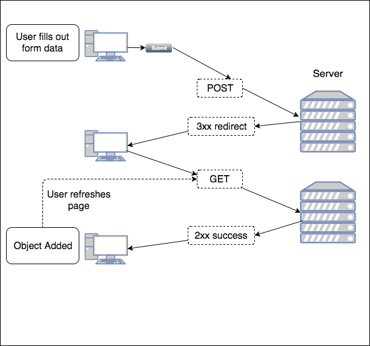

## Preventing Duplicate Posts

After `POST`ing data to a page, it is possible for the user to refresh the page and thus resubmit the form. This could cause unintended behavior on the server, such as creating a duplicate object. Browsers often make a user confirm this request, but some may not.



The server can handle this using the _Post/Redirect/Get_ design pattern.

### Post/Redirect/Get

In the Post/Redirect/Get (PRG) pattern, a user `POST`s data to a page. Instead of retuning a View to display, the server returns a `3xx Redirect` command. This causes the browser to make a second request to the server for a different page. This second request is a `GET`.



Since there is now a second request, refreshing the browser will _not_ cause a form to be resubmitted with the original `POST`; instead, refreshing would cause a `GET` request.

### PRG and Spring MVC

It is best to create two methods to implement PRG. Consider the class below, where only one method is created to handle a `POST`.

```java
@Controller
public class StateController {
  @Autowired
  private StateDAO stateDao;
  @RequestMapping(path="NewState.do",
                  method=RequestMethod.POST)
  public ModelAndView newState(State state) {
    stateDao.addState(state);
    ModelAndView mv = new ModelAndView();
    mv.setViewName("result.jsp");
    return mv;
  }
}
```

Rather than return a JSP view, we can set the ViewName to redirect to a different mapping with the `redirect:` prefix. Below, we will instruct Spring MVC to return a redirect to `stateCreated.do`. We also add a method to handle that request.

```java
@Controller
public class StateController {
  @Autowired
  private StateDAO stateDao;
  @RequestMapping(path="NewState.do",
                  method=RequestMethod.POST)
  public ModelAndView newState(State state) {
    stateDao.addState(state);
    ModelAndView mv = new ModelAndView();
    //mv.setViewName("result.jsp");
    mv.setViewName("redirect:stateCreated.do"); //redirect to new mapping
    return mv;
  }

  @RequestMapping(path="stateCreated.do",       //mapping to handle Redirect
                  method=RequestMethod.GET)
  public ModelAndView created() {
    ModelAndView mv = new ModelAndView();
    mv.setViewName("result.jsp");
    return mv;
  }
}
```

Like any Spring request handler method, we could just return a String for the redirect.

```java
@RequestMapping(path="NewState.do",
                method=RequestMethod.POST)
public String newState(State state) {
  stateDao.addState(state);
  return "redirect:stateCreated.do"; //redirect to new mapping
}
```

### PRG and Model Attributes

The `redirect:mapping` viewName in causes a second request, which means any attributes added to the Model will not be available (since they were added to the first request). We handle this issue by adding attributes to a `RedirectAttributes` object, using the method `addFlashAttribute`.

`addFlashAttribute` automatically adds the object to the model of the target URL (the one handling the Redirect's `GET` request). To access the object, add it as a method parameter with the annotation `@ModelAttribute` with the attribute name. (`@ModelAttribute` is discussed in more detail in the next chapter.)

Make sure to add the annotation `<mvc:annotation-driven/>` to your Spring configuration file to enable this behavior.

```java
@Controller
public class StateController {
  @Autowired
  private StateDAO stateDao;
  @RequestMapping(path="NewState.do",
                  method=RequestMethod.POST)
  public ModelAndView newState(State state,
                      RedirectAttributes redir) {
    stateDao.addState(state);
    ModelAndView mv = new ModelAndView();
    //mv.setViewName("result.jsp");
    redir.addFlashAttribute("state", state);    //add "state" to model for next request
    mv.setViewName("redirect:stateCreated.do"); //redirect to new mapping
    return mv;
  }

  @RequestMapping(path="stateCreated.do",       //mapping to handle Redirect
                  method=RequestMethod.GET)     //"state" is already in model for
                                                //use by result.jsp
  public ModelAndView created() {
    ModelAndView mv = new ModelAndView();
    mv.setViewName("result.jsp");
    return mv;
  }
}
```

<hr>

[Prev](command.md) | [Up](../README.md) | [Next](unittesting.md)
