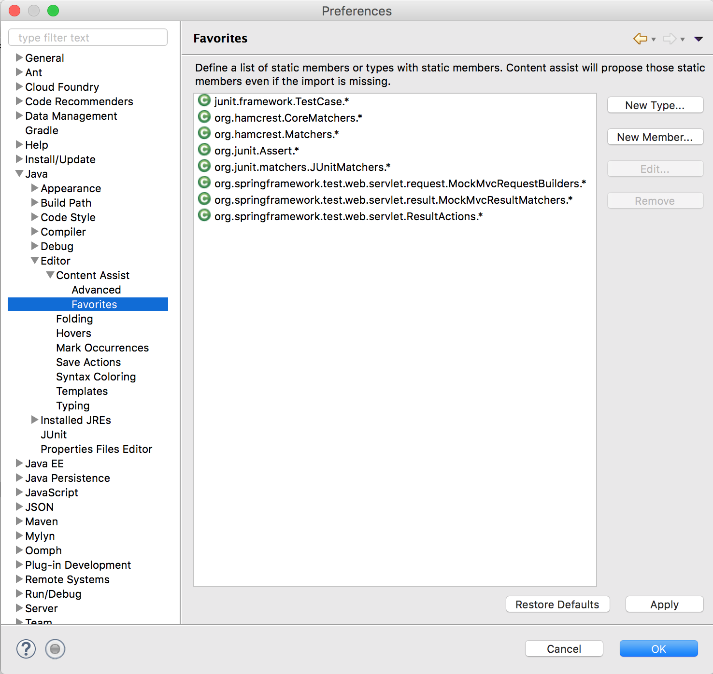

## Unit Testing Spring MVC

* Spring MVC Controllers should be testable with JUnit, just like any other POJO.

  * We can test outputs of the Controller methods, such as

    * View names (when returning a String)

    * Model objects (when supplying or returning a ModelAndView).

  * Controller class mapping

    ```java
    @RequestMapping(path="GetBook.do", method=RequestMethod.GET)
    public ModelAndView getBook() {
      ModelAndView mv = new ModelAndView();
      mv.setViewName("getbook.jsp");
      mv.addObject("books", bookDAO.getAllBooks());
      return mv;
    }
    ```

  * Unit test method

    ```java
    //brevity...
    BooksController controller = new BooksController();

    public void test_get_getBook_returns_getBook_view_and_adds_books_to_model(){
      ModelAndView view = controller.getBook();
      assertNotNull(view);
      assertEquals("getbook.jsp", view.getViewName());

      ModelMap map = view.getModelMap();
      assertNotNull(map);
      List<Book> bList = (List<Book>) map.get("books");
      assertNotNull(bList);
      assertEquals(2, bList.size());
    }
    ```

    * In the above test we get the `ModelMap` from the `ModelAndView` object, and check if objects have been added.

* We could also pass in a `Model` object to methods that use it as a parameter, and then test that object. We use an implementation of the `Model` interface called `BindingAwareModelMap`.

  * Controller class mapping

    ```java
    @RequestMapping(path="GetPerson.do", method=RequestMethod.GET)
  	public String getPerson(Model model) {
  	  model.addAttribute("persons",  personDAO.getAllPersons());
  	  return "getperson.jsp";
  	}
    ```

  * Unit test method

    ```java
    import org.springframework.validation.support.BindingAwareModelMap;
    //... brevity

    public class PersonsControllerTests {
      PersonsController controller = new PersonsController();

      public void test_get_getPerson_returns_getPerson_view_and_adds_persons_to_model(){
        Model model = new BindingAwareModelMap();
        String view = controller.getPerson(model);
        assertEquals("getperson.jsp", view);

        //Get objects in the model as a map
        Map<String, Object> map = model.asMap();
        List<Person> bList = (List<Person>) map.get("persons");
        assertNotNull(bList);
        assertEquals(2, bList.size());
      }
    }
    ```

### Server-side Testing with Spring MVC Test
* Often it is useful to test request mapping, data binding, type conversion, validation, and more.

  * Spring provides a way of testing these through the actual `DispatcherServlet` in the `spring-test` module.

    * This allows performing requests and generating responses without the need for running in a Servlet container.

  * To include it, add the Maven dependency.
    ```xml
    <dependency>
        <groupId>org.springframework</groupId>
        <artifactId>spring-test</artifactId>
        <version>4.3.2.RELEASE</version>
    </dependency>
    ```

#### Example JUnit test file which uses the Spring MVC Test framework.

```java
import static org.springframework.test.web.servlet.request.MockMvcRequestBuilders.post;
import static org.springframework.test.web.servlet.result.MockMvcResultMatchers.status;
//...brevity

@RunWith(SpringJUnit4ClassRunner.class)
//Default file name is class with '-context.xml'
@ContextConfiguration(locations={"BooksControllerTests-context.xml"})
@WebAppConfiguration
public class BooksControllerTests2 {
  @Autowired
  WebApplicationContext wac;

  private MockMvc mockMvc;

  @Autowired
  BooksController controller;

  BookDAO mockDAO;

  @Before
  public void setUp() throws Exception {
    mockDAO = wac.getBean(MockBookDAO.class);
    //add a Mock object, which we control
    controller.setBookDAO(mockDAO);
    this.mockMvc = MockMvcBuilders.webAppContextSetup(wac).build();
  }
  @Test
  public void test_post_getBook_String_returns_results_view(){
    try{
      MvcResult result = mockMvc.perform(post("/GetBook.do").param("isbn", "1111111111111")).andExpect(status().isOk())
          .andReturn();
      ModelAndView mv = result.getModelAndView();
      assertEquals("results.jsp", mv.getViewName());
    }
    catch(Exception e){
      fail(e.toString());
    }
  }
}
```

The Spring configuration is loaded from an XML file located in the same directory:

```xml
<?xml version="1.0" encoding="UTF-8"?>
<beans xmlns="http://www.springframework.org/schema/beans"
  xmlns:xsi="http://www.w3.org/2001/XMLSchema-instance" xmlns:mvc="http://www.springframework.org/schema/mvc"
  xmlns:context="http://www.springframework.org/schema/context" xmlns:tx="http://www.springframework.org/schema/tx"
  xsi:schemaLocation="
    http://www.springframework.org/schema/mvc http://www.springframework.org/schema/mvc/spring-mvc-4.3.xsd
    http://www.springframework.org/schema/beans http://www.springframework.org/schema/beans/spring-beans-4.3.xsd
    http://www.springframework.org/schema/context http://www.springframework.org/schema/context/spring-context-4.3.xsd
    http://www.springframework.org/schema/tx http://www.springframework.org/schema/tx/spring-tx-4.3.xsd">

  <!-- Scan the controllers package. Do not scan data package because we are
  creating a BookDAO and there can be only one BookDAO if Controller has an
  @Autowired field -->
  <context:component-scan base-package="controllers"/>
  <mvc:annotation-driven/>

  <!-- A mock object to create books -->
  <bean id="mockBookDAO" class="controllers.MockBookDAO"/>
</beans>
```

* This file matches the servlet application context, but also loads a _mock object_.

  * A mock object is a simple object with known outputs that implements the interface which a class requires.

  * The mock object is injected into the bean under test in order to control data.

#### Performing Requests

* The `MockMVC` instance is used to perform a `POST` request.

  * You can perform requests using any HTTP method:

  * The results are returned as a MvcResult object, which can be tested for content.

  * You can specify query parameters in URI template style:

    ```java
    mockMvc.perform(get("/persons?name={name}", "bobby"));
    ```

  * Or you can add Servlet request parameters representing either query or form parameters:

    ```java
    mockMvc.perform(get("/persons").param("name", "bobby"));
    ```
  * **Note**: The request requires a leading "/" character.

### Hamcrest Matchers

* A useful library for unit testing is the Hamcrest library.

  * It provides a large set of objects, which can be statically imported, that allow the developer to chain tests.

* Tests often start with the Matcher `assertThat`.

  * We can then check `allOf` the properties of an object with the method `hasProperty`.

    ```java
    import static org.hamcrest.CoreMatchers.is;
    import static org.hamcrest.Matchers.allOf;
    import static org.hamcrest.Matchers.hasProperty;
    
    //brevity...
    @Test
    public void test_post_getBook_String_returns_results_view_and_book(){
      try{
        MvcResult result = mockMvc.perform(post("/GetBook.do").param("isbn", "1111111111111")).andExpect(status().isOk())
            .andReturn();
        ModelAndView mv = result.getModelAndView();
        assertThat(mv, hasProperty("viewName", is("results.jsp")));

        ModelMap map = result.getModelAndView().getModelMap();
        Book b = (Book) map.get("book");
        assertThat(b,
            allOf(
                hasProperty("isbn", is("1111111111111")),
                hasProperty("title", is("Title1")),
                hasProperty("author", is("Author1")),
                hasProperty("totalSold", is(10)),
                hasProperty("yearPublished", is(2001))
            )
          );
      }
      catch(Exception e){
        fail(e.toString());
      }
    }
    ```

  * **Note**: Hamcrest matchers are useful, but can be tricky.

    * A mismatched parenthesis can break what looks to the eye like a valid test.

  * Include the hamcrest dependency to call methods like `hasProperty`.

  ```xml
  <!-- https://mvnrepository.com/artifact/org.hamcrest/hamcrest-library -->
  <dependency>
      <groupId>org.hamcrest</groupId>
      <artifactId>hamcrest-library</artifactId>
      <version>1.3</version>
  </dependency>
  ```

### Unit Testing Post/Redirect/Get

Unit testing PRG has two differences from regular unit tests.

  * Test to see that a 3xx redirect has occurred rather than 200 "OK", and the view returned is the correct `redirect:XXX` location.

  ```java
  MvcResult result = mockMvc.perform(post("/NewState.do")
					.param("abbreviation", "PR")

          //... more parameters
					)
					.andExpect(status().is3xxRedirection())  // check for redirection instead of isOk()
          .andReturn();
  ModelAndView mv = result.getModelAndView();
			assertEquals("redirect:stateAdded.do", mv.getViewName());
  ```

  * If flash attributes were added, check if the handler method added them using the Hamcrest matcher `flash()`. (This requires the Hamcrest dependency in `pom.xml`.)

  ```java
  MvcResult result = mockMvc.perform(post("/NewState.do")
					.param("abbreviation", "PR")
					//... more parameters
					)
					.andExpect(status().is3xxRedirection())
					.andExpect(flash().attribute("state", hasProperty("abbreviation", is("PR"))))
					.andReturn();
  ```

### Eclipse Setup for Unit Testing

Many of the methods for unit testing require static imports.

  * We must configure Eclipse's content assist to recommend these libraries.

  * Go to _Eclipse(Window) | Preferences | Java | Editor | Content Assist | Favorites_

    

  * And add each of the following lines by selecting `New Type`

    ```
    junit.framework.TestCase
    org.hamcrest.CoreMatchers
    org.hamcrest.Matchers
    org.junit.Assert
    org.junit.matchers.JUnitMatchers
    org.springframework.test.web.servlet.request.MockMvcRequestBuilders
    org.springframework.test.web.servlet.result.MockMvcResultMatchers
    org.springframework.test.web.servlet.ResultActions
    ```

  * The order of the lines does not matter.

<hr>

[Prev](post_redirect_get.md) | [Up](../README.md) | [Next](states_lab.md)
