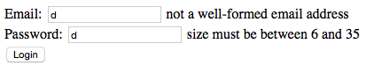
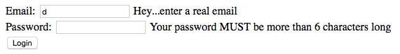
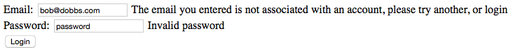
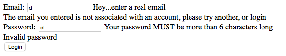

## Improving Feedback with Custom Messages

### Creating Custom Messages with Annotations

* The error messages we've seen so far are the default messages based on the validation annotations added to the `User` class.

  ```java
  public class User {
    @Email
    private String email;
    @Size(min = 6, max = 35)
    private String password;

    // ...
  }
  ```

  

* You can improve upon this messaging by adding a `message=""` attribute to the annotations.

  * This `message` will take the place of the default message.

  ```java
  public class User {
  	@Email(message = "Hey...enter a real email")
  	private String email;
  	@Size(min = 6, max = 35, message = "Your password MUST be more than 6 characters long")
  	private String password;

  	// ...
  }
  ```

  

### Manually Adding Errors Based On Custom Validation

* Situations may arise where you will want to display errors based on your own validation.

* Spring makes it easy to add error messages manually.

  * The `Errors.rejectValue("property", "error.property", "error message")` allows yout to add these error messages.

* The following example uses authentication methods to determine if login information is valid; if it is not, we add error messages informing the user of what went wrong.

  ```java
  @RequestMapping(path = "login.do", method = RequestMethod.POST)
	public ModelAndView doLoginErrorChecking(@Valid User user, Errors errors) {
		ModelAndView mv = new ModelAndView();

		// Use DAO method to obtain user by email (or null if they aren't a user)
		User loggedInUser = authDao.validEmail(user.getEmail());

		// If user is null, let the user know they need to create an account
		if (loggedInUser == null) {
			// Assigns an error to the 'email' property
			errors.rejectValue("email", "error.email",
			    "The email you entered is not associated with an account, please try another, or login");
		}
		// If the password provided is not valid, let the user know
		if (!authDao.validPassword(user)) {
			// Assigns an error to the 'password' property
			errors.rejectValue("password", "error.password", "Invalid password");
		}
		// If any of the above, or the validation errors from the User class
		// failed, errors.getErrorCount() will be greater than 0
		if (errors.getErrorCount() != 0) {
			mv.setViewName("login.jsp");
			return mv;
		}
		mv.addObject("user", loggedInUser);
		mv.setViewName("profile.jsp");
		return mv;
	}
  ```

  

* If the validation from the `User` class is invalid (in addition to the custom validation you created), both error messages will be displayed:

  

<hr>

[Prev](forms.md) | [Up](../README.md) | [Next](properties.md)
