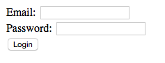

## Add Validation to Forms

### Using `form:form`

* Spring MVC provides its own custom form tags to simplify form building and automate displaying errors to the user.

  ```html
  <%@ taglib uri="http://www.springframework.org/tags/form" prefix="form" %>
  ```

* The `form` `@taglib` directive should be applied to the top of your JSP the same way that the `core` `@taglib` is:

  ```html
  <!-- JSP -->
  <%@ page language="java" contentType="text/html; charset=UTF-8"
    pageEncoding="UTF-8"%>
  <%-- core --%>
  <%@ taglib uri="http://java.sun.com/jsp/jstl/core" prefix="c"%>
  <%-- form --%>
  <%@ taglib uri="http://www.springframework.org/tags/form" prefix="form"%>
  <!DOCTYPE html>
  <html>
    <head>
      <meta http-equiv="Content-Type" content="text/html; charset=UTF-8">
      <title>Login</title>
    </head>
    <body>
    </body>
  </html>
  ```

* Use the `<form:form>` tag to create a form:

  ```html
  <!-- login.jsp -->
  <%@ page language="java" contentType="text/html; charset=UTF-8"
    pageEncoding="UTF-8"%>
  <%@ taglib uri="http://java.sun.com/jsp/jstl/core" prefix="c"%>
  <%@ taglib uri="http://www.springframework.org/tags/form" prefix="form"%>
  <!DOCTYPE html PUBLIC "-//W3C//DTD HTML 4.01 Transitional//EN" "http://www.w3.org/TR/html4/loose.dtd">
  <html>
  <head>
  <meta http-equiv="Content-Type" content="text/html; charset=UTF-8">
  <title>Login</title>
  </head>
  <body>
    <form:form action="login.do" method="POST" modelAttribute="user">
    </form:form>
  </body>
  </html>
  ```

  * Use the `action=""` attribute to identify which request method (`@RequestMapping`) to bind to.

  * Use the `modelAttribute=""` to specify which command object (in the controller method) the form maps to.

    * This object **MUST** be placed into the model with the same name before the form is displayed.

    * **Example:**

      * You have a form like the one above with a `modelAttribute="user"`.

      * The `user` being referenced must be provided by the controller when this JSP is presented:

      ```java
      // LoginController.java
      @RequestMapping(path="GetLoginForm.do", method=RequestMethod.GET)
      public ModelAndView getLoginForm() {
        User u = new User();
        ModelAndView mv = new ModelAndView();
        mv.setViewName("login.jsp");
        mv.addObject("user", u);
        return mv;
      }
      ```

  * The above controller method adds a `User` object into the model in the namespace `"user"`.

    * This is the `User` object that will be referenced by the `modelAttribute="user"`

### Using `form:input`

* The `<form:input>` element will result in an HTML text input box.

  ```html
  <!-- login.jsp -->

  <!-- wrapper code excluded for brevity -->
  <form:form action="login.do" method="POST" modelAttribute="user">
    <form:input path="email" />
    <br />
    <form:input path="password" />
    <br />
    <input type="submit" value="Login" />
  </form:form>
  ```

  * Which results in:

    

* Rather than a `name` attribute, the `<form:input>` tag has a `path` which maps to a property on the command object you previously identified with `<form:form modelAttribute="user">`

  * **E.G.** `<form:input path="email" />` means `user.email` in EL.

### Using `form:errors`

* The `<form:errors>` tag will display any validation errors that correspond to the property identified by the `path` attribute (similar to `<form:input>`):

  ```html
  <!-- login.jsp -->

  <!-- wrapper code excluded for brevity -->
  <form:form action="login.do" method="POST" modelAttribute="user">
    <form:input path="email" />
    <form:errors path="email" />
    <br />
    <form:input path="password" />
    <form:errors path="password" />
    <br />
    <input type="submit" value="Login" />
  </form:form>
  ```

  * Assume the `User` class looks like this:

    ```java

    public class User {
    	@Email
    	private String email;
    	@Size(min = 6, max = 35)
    	private String password;

    	public String getEmail() {
    		return email;
    	}

    	public void setEmail(String email) {
    		this.email = email;
    	}

    	public String getPassword() {
    		return password;
    	}

    	public void setPassword(String password) {
    		this.password = password;
    	}
    }
    ```

* If invalid data were entered into the form, this would be the result:

  

### Additional Form Tags

* There are additional form tags available, these include:

  * `form:password`
  * `form:textarea`
  * `form:checkbox`
  * `form:select`
  * `form:radiobutton`
  * ...and more

<hr>

[Prev](controller_validator.md) | [Up](../README.md) | [Next](custom_messages.md)
