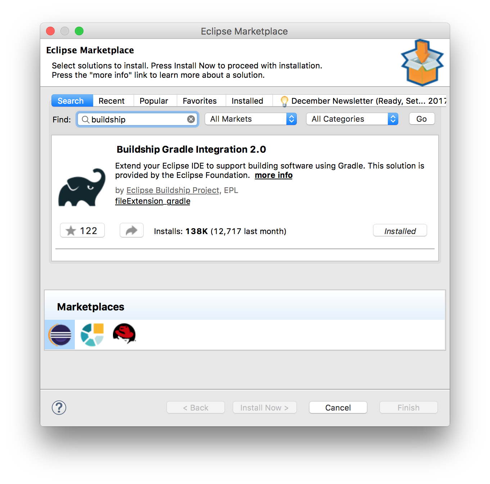
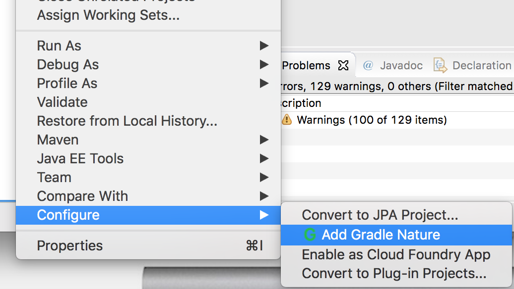
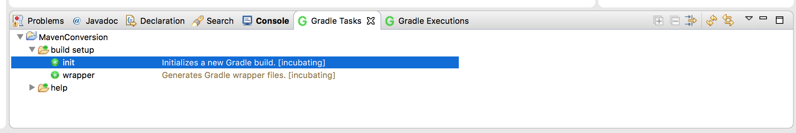
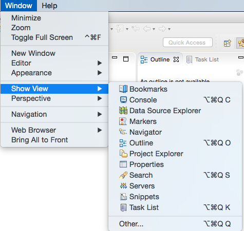
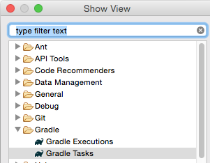

## Gradle Setup

* Gradle is not included with Eclipse, so users must download a tool to use it. The easiest way to do this is to find "Buildship Gradle Integration" in the Eclipse Marketplace.

### Using an Existing Workspace Project

* Once Buildship is installed, right-click a project and choose _Configure->Add Gradle nature_.

  
  
  * Then, in the _Gradle Tasks_ view, double-click init.
  
  

  * **NOTE:** If the Gradle view is not immediately available, add the _Gradle Tasks_ view, by choosing _Window -> Show View -> Other... -> Gradle -> Gradle Tasks_

  
  

  * This will generate a `build.gradle` script, where you can add dependencies and customizations.
  
    * It also generates a `settings.gradle`, which specifies your project name and where you can include other configuration, such as adding workspace projects.
  
    * _Note: you may have to refresh [fn + F5] the Package Explorer view to see these files._
  
* You can convert _existing_ Maven projects to Gradle.

  * Gradle will preserve as much configuration as possible from the `pom.xml` and incorporate it into `build.gradle`

  * This is as simple as running the `gradle init` task after adding Gradle nature to an existing project. 

    * See documentation at https://gradle.org/migrating-a-maven-build-to-gradle/.

  * Note that you will have to manually edit the `build.gradle` file to add or remove configuration, such as properties and plugins.

[Prev](README.md) | [Up](../README.md) | [Next](02_gradleConfig.md)
