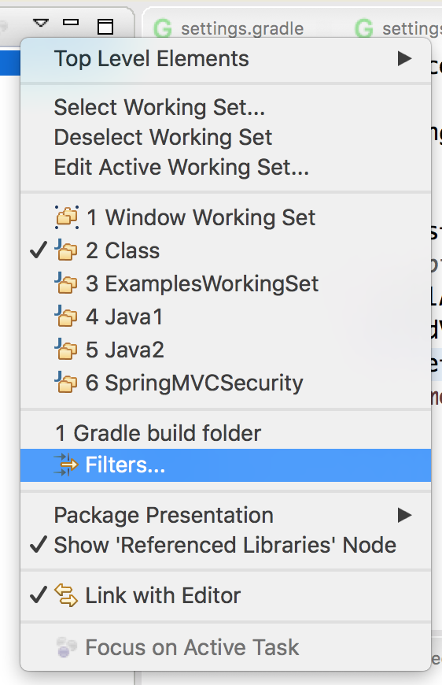
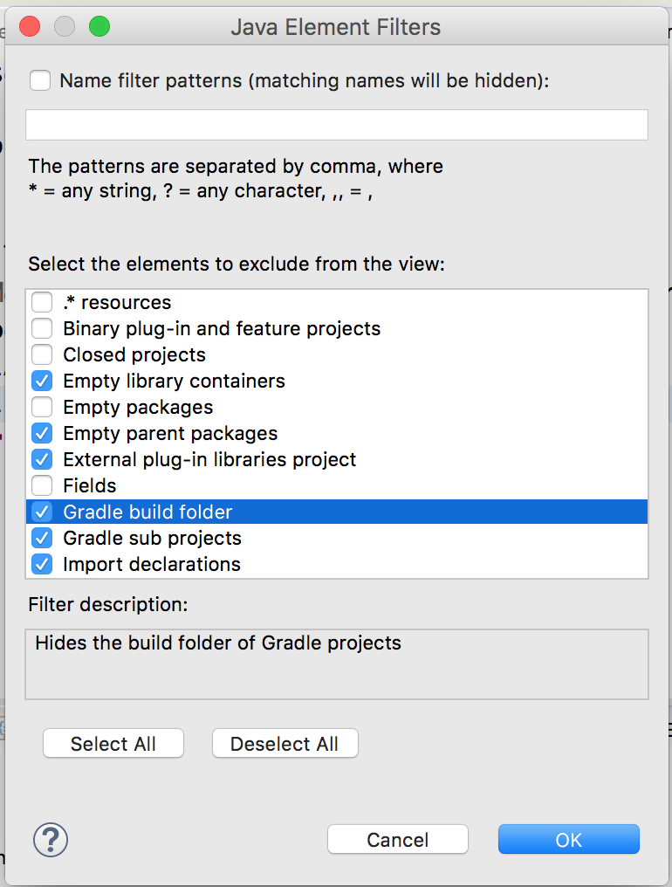

## `build.gradle`: the Build Configuration Script

* Gradle expects a file named `build.gradle` in the project root directory.

```js
// build.gradle
apply plugin: 'java'
apply plugin: 'war'
apply plugin: 'eclipse-wtp'

sourceSets {
  main {
    java.srcDirs 'src/main/java'
  }
  test {
    java.srcDirs 'src/test/java'
  }
}
project.webAppDirName = 'WebContent'

repositories {
   mavenCentral()
}

eclipse.project  {
        natures 'org.springframework.ide.eclipse.core.springnature', 
                'org.eclipse.buildship.core.gradleprojectnature'
}

dependencies {
    compile group: 'org.springframework', name: 'spring-webmvc', version:'4.3.2.RELEASE'
    compile group: 'javax.servlet', name: 'javax.servlet-api', version:'3.1.0'
    compile group: 'javax.servlet', name: 'jstl', version:'1.2'
    testCompile group: 'junit', name: 'junit', version: '4.12'
    testCompile group: 'org.springframework', name: 'spring-test', version:"4.3.2.RELEASE"
}
```

* Dependencies may also be listed in the format `group:name:version`.

  ```js
  dependencies {
      compile group: 'org.hibernate', name: 'hibernate-core', version: '3.6.7.Final'
  }
  ```
  is the same as :  
  ```js
  dependencies {
      compile 'org.hibernate:hibernate-core:3.6.7.Final'
  }
  ```

* To sync versions, you can use variables:

  ```js
  ...
  ext {
  	springVersion = "4.3.2.RELEASE"
  }
  dependencies {
      // Must use doublequotes ("") to allow variable expansion:
      compile group: 'org.springframework', name: 'spring-webmvc', version: "$springVersion"
      testCompile group: 'org.springframework', name: 'spring-test', version: "$springVersion"
  ...
  ```

* Another feature is "fuzzy" version specification, where users can instruct Gradle to always download newer versions of libraries.  

For example:

```js
...
dependencies {
    compile group: 'org.hibernate', name: 'hibernate-core', version: '5.2.5.Final'
    testCompile group: 'junit', name: 'junit', version: '4.+'
}
...
```
  * The build script states that any junit >= 4.0 is required to compile the project's tests. Dependency management will resolve the "4.+" to the latest static version of JUnit, like 4.12, in the repository.

  * **NOTE:** static version numbers, like 4.12, are strongly recommended; otherwise, Gradle could download and integrate newer libraries, and introduce issues.

* Often you will want to download source files (for debugging, etc.). Do this by adding the configuration below. After configuring, be sure to refresh the project with _Gradle->Refresh Gradle Project_.

  ```
  eclipse {
  	classpath {
  		downloadSources = true
  	}
  }
  ```

  * **NOTE:** This may apply a filter that hides the build folder. To remove this, click the _View Menu_ in _Package Explorer_ (the down arrow you use to configure working sets) and select _Filters_. Then **uncheck** _Gradle build folder_.






[Back](01_gradleSetup.md) | [Up](../README.md) | [Next](03_gradlePlugins.md)
