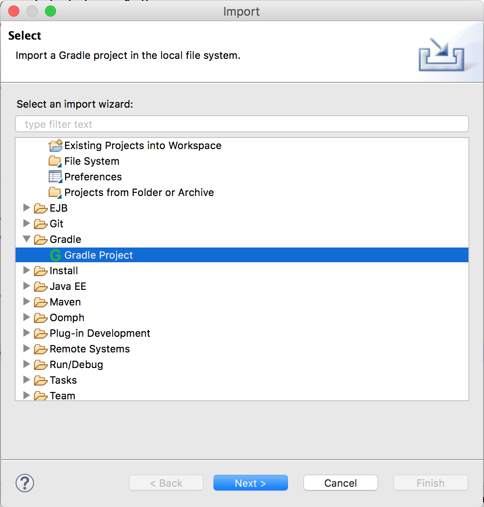
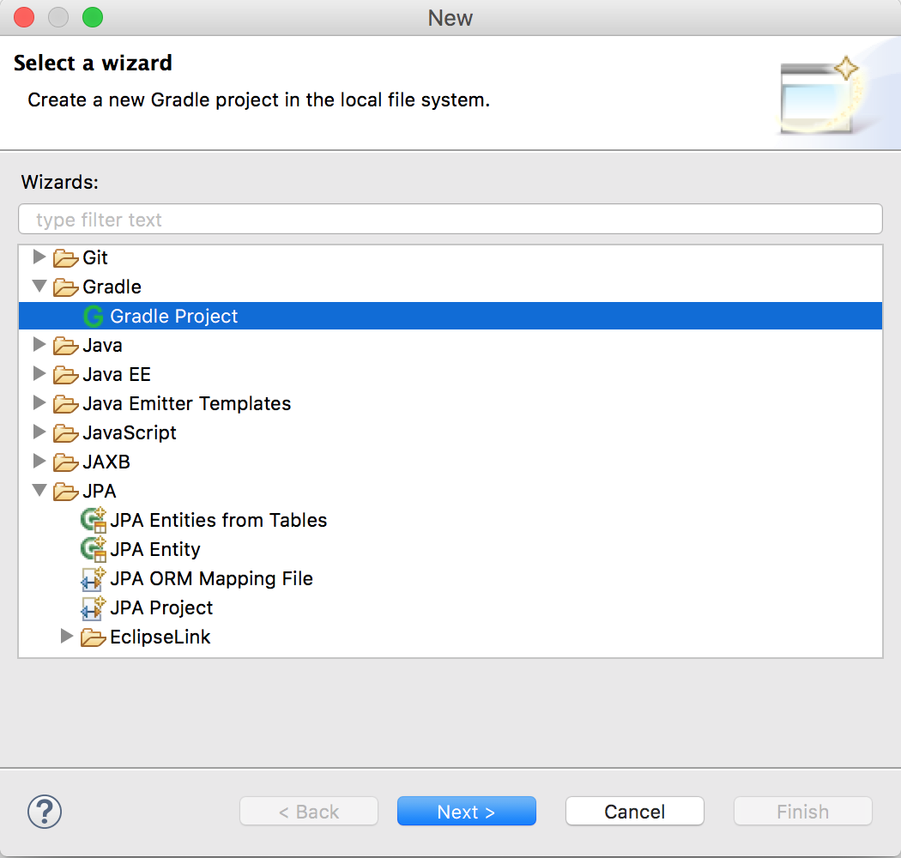
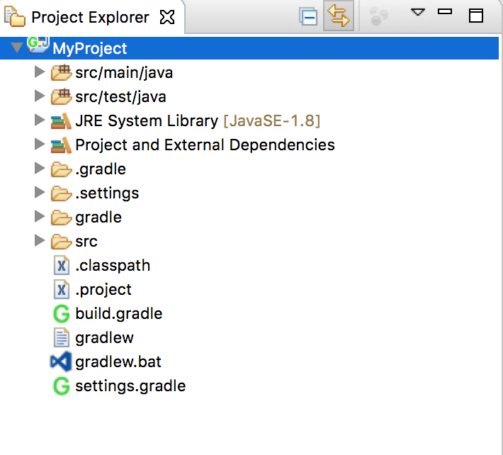
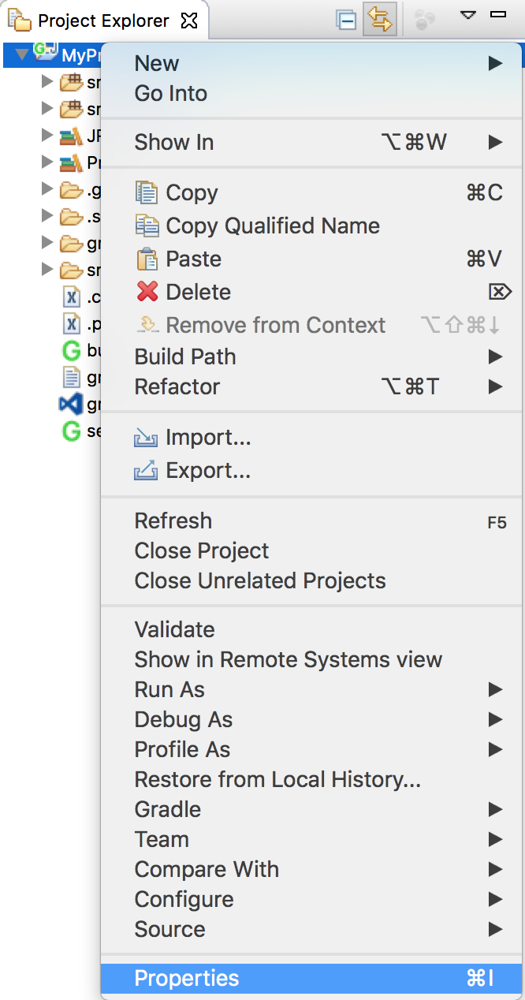
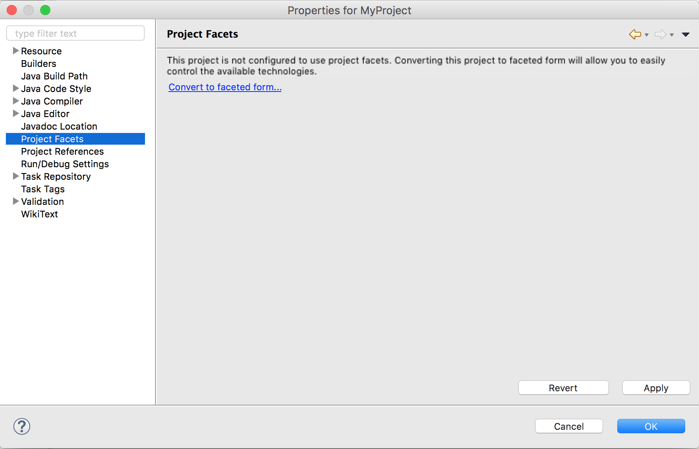
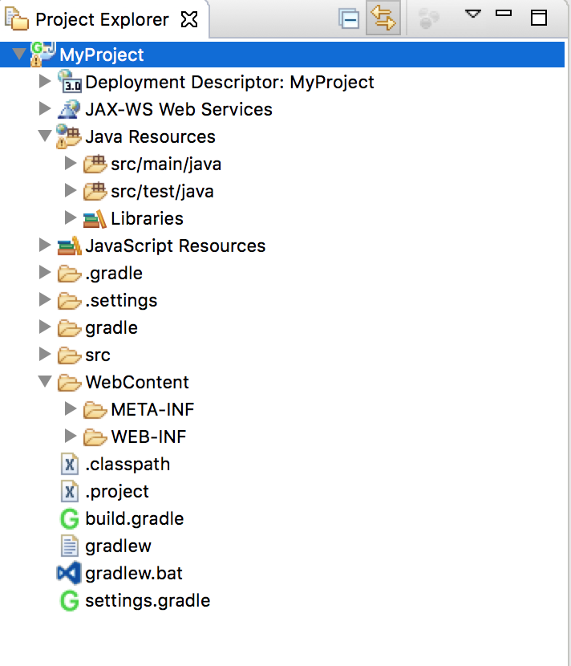

## Working with Gradle Projects in Eclipse

### Steps to Create a Gradle Web Project in STS

1. _File_ | _New_ | _Dynamic Web Project_
   * Dynamic Web Project:
     * Project Name: _MyProject_
     * Target Runtime: _None_
     * **Next**
   * Java
     * Source folders on build path:
     * Remove _src_
     * Add Folder...:
       * _src/main/java_
       * _src/test/java_
     * **Next**
   * Web Module
     * Check _Generate web.xml deployment descriptor_
     * **Finish**

2. _Configure_ | _Add Gradle Nature_
   * Drag your project to your working set.

3. Gradle Tasks 
   * Refresh the Gradle Tasks view to see your new project
   * _build-setup_ | **init**

4. Package Explorer
   * F5 refresh to see Gradle files
   * Open `build.gradle`
   * Delete generated contents and replace with starter sample below.
   * _Right-click_ | _Gradle_ | _Refresh Gradle Project_ to load dependencies.

5. Start coding!
   
### Starter `build.gradle` for Spring/MVC web projects

```java
/*
* Sample Gradle build configuration for a Spring/MVC project 
*/

version = '1.0.0-BUILD-SNAPSHOT'  // Bump this as you add features/fix bugs

apply plugin: 'java'
apply plugin: 'war'
apply plugin: 'eclipse-wtp'

sourceSets {
  main {
    java.srcDirs 'src/main/java'
  }
  test {
    java.srcDirs 'src/test/java'
  }
}

war {
  archiveName = "${baseName}.war"
  destinationDir = file("./")      // Project root
}

project.webAppDirName = 'WebContent'

repositories {
   mavenCentral()
}

eclipse {
  classpath {
    downloadSources = true
  }
  project  {
    natures 'org.springframework.ide.eclipse.core.springnature', 
            'org.eclipse.buildship.core.gradleprojectnature'
  }
}

dependencies {
    compile group: 'org.springframework', name: 'spring-webmvc', version:'4.3.2.RELEASE'
    compile group: 'javax.servlet', name: 'javax.servlet-api', version:'3.1.0'
    compile group: 'javax.servlet', name: 'jstl', version:'1.2'
    compile group: 'org.hibernate', name: 'hibernate-validator', version:'5.2.4.Final'
    testCompile group: 'junit', name: 'junit', version:'4.12'
    testCompile group: 'org.springframework', name: 'spring-test', version:'4.3.2.RELEASE'
    testCompile group: 'org.hamcrest', name: 'hamcrest-junit', version:'2.0.0.0'
}
```

### Other Tips and Troubleshooting

#### cleanEclipse Task - help!
* If you ran the _cleanEclipse_ task, your eclipse files were deleted. To restore them, run the `eclipse` task. You may have to right-click the project and choose _Configure->Add Gradle Nature_. Be sure to refresh the project after making changes.

#### Gradle Cache
* The libraries Gradle downloads are usually stored in _~/.gradle/caches/modules-2/files-2.1_ by default. If Eclipse or Tomcat says a class cannot be found, deleting this _~/.gradle/caches_ may solve this issue. Be sure you do not delete all of _~./gradle_.

#### Including Workspace Projects

* A project can include related Eclipse projects.

  * This enables easy building and deployment, and is one of the main benefits of using Gradle instead of Maven for Eclipse development.

* In `settings.gradle` add a line for each project you want to include.

  ```js
  includeFlat 'MyDataModuleProject'
  ```

  * `includeFlat` requires that projects be siblings to the main project, which is your usual Eclipse setup.

* In your main project's `build.gradle`, add the project to `dependencies`.

  ```js
  dependencies {
    ...
    compile project(':MyDataModuleProject')
  }
  ```

#### Importing Existing Project

* Importing a Gradle project into a workspace requires a different import wizard than other Eclipse project types: choose _File->Import->Gradle->Gradle Project_.



  * Choose a project as you would with an existing Eclipse project, then refresh the imported project by right-clicking and selecting _Gradle->Refresh Project_.

#### Creating a New Project in Eclipse
You can also start by creating a Gradle project and adding the Dynamic Web facet afterward:

* Create a new Gradle project with _File->New->Gradle Project_.

  

  * This will create Gradle's default directories for source code, `src/main/java` and `src/test/java`, as well as Gradle configuration files.

  

* Adding Dynamic Web Capabilities
  * If you have created a Gradle Project, there is no `WebContent` directory. You can add this, and other _Dynamic Web Project_ features, by configuring project facets.

  * Select _Project->Properties_.

   

  * Select _Project Facets_. You may have to _Convert to faceted form_.

   

  * Choose _Dynamic Web Module_. This will create the `WebContent` directory.

   

    ```js
    project.webAppDirName = 'WebContent'
    ```

[Back](03_gradlePlugins.md) | [Up](../README.md)
