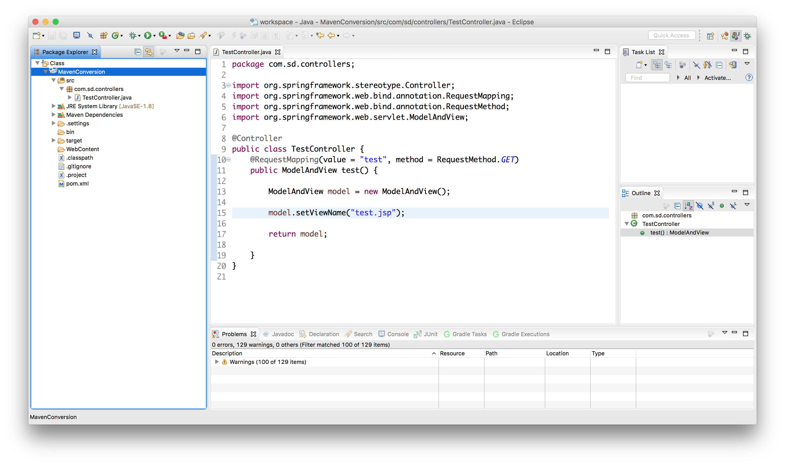
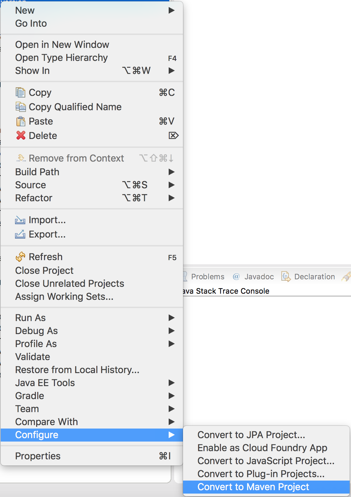

## Maven

Maven's driving philosophy is *convention-based* configuration: a project's structure should follow certain conventions, and only have to specify exceptions to the conventions.  The overall project stucture is the *Project Object Model*.

* Maven is included with Eclipse, and manages dependencies by reading an XML configuration file, `pom.xml`. Developers add libraries by using a specific syntax to direct Maven to retrieve and use the library's jar files.
  
```xml
<!-- pom.xml -->
<project xmlns="http://maven.apache.org/POM/4.0.0" xmlns:xsi="http://www.w3.org/2001/XMLSchema-instance"
	xsi:schemaLocation="http://maven.apache.org/POM/4.0.0 http://maven.apache.org/xsd/maven-4.0.0.xsd">
	<modelVersion>4.0.0</modelVersion>
	<groupId>skilldistillery</groupId>
	<artifactId>MyProject</artifactId>
	<version>0.0.1-SNAPSHOT</version>
	<build>
		<sourceDirectory>src</sourceDirectory>
		<plugins>
			<plugin>
				<artifactId>maven-compiler-plugin</artifactId>
				<version>3.5.1</version>
				<configuration>
					<source>1.8</source>
					<target>1.8</target>
				</configuration>
			</plugin>
		</plugins>
	</build>
	<dependencies>
		<dependency>
			<groupId>junit</groupId>
			<artifactId>junit</artifactId>
			<version>4.12</version>
		</dependency>
	</dependencies>
</project>
```

* Maven first checks the machine's local repository (usually `~/.m2` on a Mac or Linux) for an included library. If not found, it will download the jars from the default Maven central repository, *http://repo1.maven.org/maven2/* .  Users can add custom repositories.

* Libraries are organized by **groupId**, **artifactId**, and **version**. Users must specify the version of an artifactId for use. For example, to add the spring-test library, include the following dependency within the dependencies tag.

```xml
<dependency>
    <groupId>org.springframework</groupId>
    <artifactId>spring-test</artifactId>
    <version>4.3.2.RELEASE</version>
</dependency>
```

* Users can search for repositories at *https://search.maven.org*. Selecting an artifactId's version will display the dependency's XML, which a user can then copy-paste into their `pom.xml`.

* *https://mvnrepository.com* is also useful, and often easier to navigate. Also, this site includes syntax for other dependency managers, including [_Gradle_](gradle.md).

### Enabling Maven

* To convert an Eclipse project to use Maven, right-click the project and choose _Configure->Convert to Maven Project_. 
  

  
  
  
* The IDE will generate a basic pom.xml:
  
```xml
<!-- generated pom.xml -->
<project xmlns="http://maven.apache.org/POM/4.0.0" xmlns:xsi="http://www.w3.org/2001/XMLSchema-instance"
	xsi:schemaLocation="http://maven.apache.org/POM/4.0.0 http://maven.apache.org/xsd/maven-4.0.0.xsd">
	<modelVersion>4.0.0</modelVersion>
	<groupId>skilldistillery</groupId>
	<artifactId>MyProject</artifactId>
	<version>0.0.1-SNAPSHOT</version>
	<build>
		<sourceDirectory>src</sourceDirectory>
		<plugins>
			<plugin>
				<artifactId>maven-compiler-plugin</artifactId>
				<version>3.5.1</version>
				<configuration>
					<source>1.8</source>
					<target>1.8</target>
				</configuration>
			</plugin>
		</plugins>
	</build>
</project>
```
  
* Now, in order to include dependencies, add `<dependencies></dependencies>` below the closing `</build>` tag:  
  
```xml
<!-- pom.xml -->
<!-- ... -->
  </build>
  <dependencies>
    <dependency>
        <groupId>junit</groupId>
        <artifactId>junit</artifactId>
        <version>4.12</version>
    </dependency>
  </dependencies>
</project>
```
  

### Tips:  

* If you run into Eclipse errors stating that a library cannot be found, this may indicate a version conflict. For example, the project may be using version 4.3.2 of some project, but an included library uses 4.4.0. Make sure your libraries are compatible versions.

* Maven downloads each new library and caches it in your `~/.m2/` directory.  Sometimes, an initial download may be incomplete, causing the library's JAR file corrupt.  When you try to deploy your project to Tomcat, Tomcat will crash because it can't load the classes in the JAR.  The error may include something like:
  ```
  ...
  Caused by: java.lang.IllegalArgumentException: java.util.zip.ZipException: error in opening zip file
  	at org.apache.catalina.webresources.AbstractSingleArchiveResourceSet.initInternal(AbstractSingleArchiveResourceSet.java:113)
  	at org.apache.catalina.util.LifecycleBase.init(LifecycleBase.java:102)
  	... 12 more
  Caused by: java.util.zip.ZipException: error in opening zip file
  ...
  ```
  To fix this, you can remove the corrupt JAR from Maven's cache folder, but it may be difficult to identify which one it is.  It's simpler just to remove the entire cache:

  ```bash
  cd ~/.m2/
  rm -rf repository
  ```
  This will force all dependencies in all your projects to be downloaded again.

[Previous](README.md)

