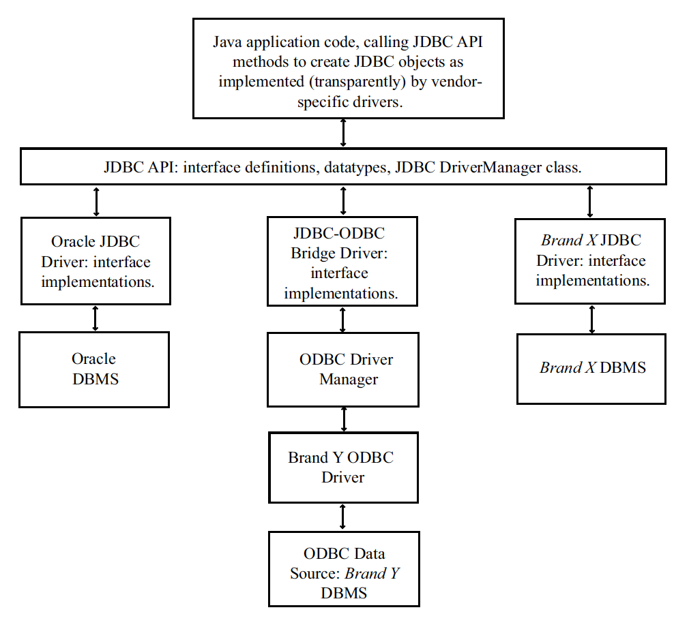

## The JDBC Connectivity Model

* JDBC provides a simple but complete programming interface for accessing Database Management Systems (DBMSs).

* Conceptually, JDBC resembles most other SQL database APIs.

  * Application programmers access a generic API, and a driver manager controls connections.

  * Vendor/product-specific drivers implement the connection and interaction with specific DBMSs.

* The `java.sql` and `javax.sql` packages define the JDBC interfaces and datatypes for dealing with database connections, statements, query results, etc.

  * Normally, you will work with just a few relatively simple interfaces and methods.

  * JDBC also provides features for tool builders and driver writers.

* Vendor-specific driver packages implement the java.sql interfaces.

  * The vendor must implement `java.sql.Driver` to provide the main entry point for JDBC.

<hr>



You generally obtain a driver from the database vendor or from a third-party repository as a ZIP or JAR archive. The archive has compiled classes which implement the `java.sql` interfaces for the specific database product. You'll need to include this driver archive in your classpath and with your deployed application.

JDBC Driver types:
1. JDBC-ODBC bridge
2. Native-API driver
3. Network-Protocol driver (Middleware driver)
4. Database-Protocol driver (Pure Java driver) or thin driver.

### Hands On:
Add the MySQL Connector/Java (that is, the MySQL driver) dependency to your project.  Note the driver version must be compatible with your MySQL version.

* If you're using Maven, add to `<dependencies>` in `pom.xml`:

  ```xml
  <!-- https://mvnrepository.com/artifact/mysql/mysql-connector-java -->
  <dependency>
      <groupId>mysql</groupId>
      <artifactId>mysql-connector-java</artifactId>
      <version>5.1.42</version>
  </dependency>
  ```

  * Maven | Update Project

* If you're using gradle, add to `dependencies` in `build.gradle`:

  ```
  // https://mvnrepository.com/artifact/mysql/mysql-connector-java
  compile group: 'mysql', name: 'mysql-connector-java', version: '5.1.42'
  ```

  * Gradle | Refresh Gradle project


[Prev](README.md) | [Up](../README.md) | [Next](DBPrograms.md)

