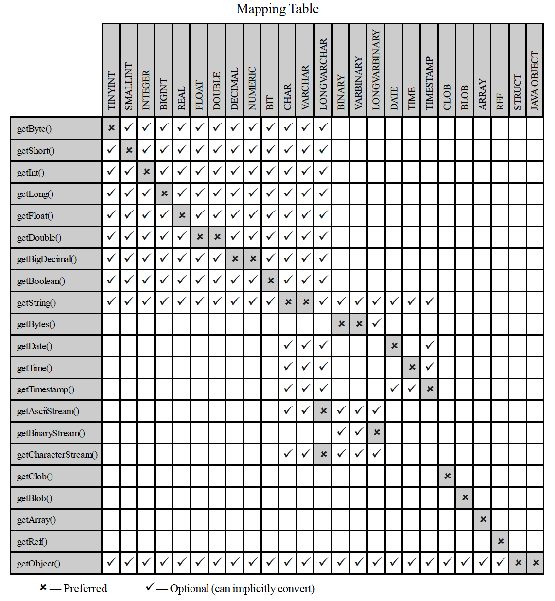

## JDBC Types

* JDBC defines datatypes to separate the Java developer from the database implementation.

  * Database vendors often support different types of data or use different names for the datatypes.

  * The driver is responsible for converting DBMS types to JDBC types.

  * JDBC datatypes are based on standard SQL datatypes.

* When you use a `getXXX()` method on a `ResultSet`, the `XXX` refers to the Java type that is returned.

  ```java
  int id = rs.getInt(1);
  String lastName = rs.getString(3);
  ```

  * There is a suggested `getXXX()` method for each JDBC datatype, but there is usually more than one choice.

    * For example, you can retrieve a DBMS INTEGER value as a JDBC String.

    * `getObject()` works for any JDBC type.

  * Look in the mapping table to see which JDBC types are supported by which `getXXX()` methods.

* The `java.sql.Types` class defines a static final int for each JDBC datatype.
  * These constants are the way that JDBC references the type.

<hr>



[Prev](PreparedStatement.md) | [Up](../README.md) | [Next](Closing.md)
