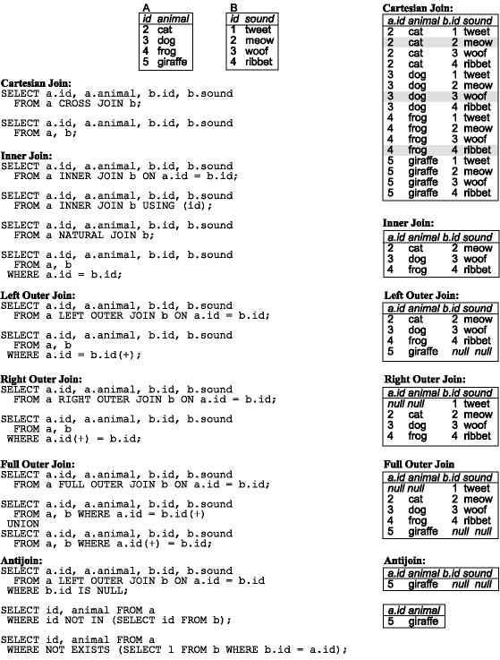

## Equijoins, Non-Equijoins, and Antijoins

* Most joins are equijoins - the join conditions compare for equality.

  ```sql
  SELECT DATE(rental_date), DATE(payment_date), amount
    FROM rental r JOIN payment p
                    ON r.id = p.rental_id
                   AND DATE(rental_date) = DATE(payment_date);
  ```

* A non-equijoin uses a condition other than equality, such as <, >, BETWEEN, or LIKE to compare the join columns.

  ```sql
  SELECT DATE(rental_date), DATE(payment_date), amount
    FROM rental r JOIN payment p
                    ON r.id = p.rental_id
                   AND DATE(rental_date) < DATE(payment_date);
  ```

  ```sql
  SELECT f.title, c.name
    FROM film f JOIN category c
                  ON f.title LIKE CONCAT(SUBSTR(c.name,1),'%');
  ```

* An antijoin is an outer join with the matched rows omitted.

  ```sql
  SELECT r.id, r.rental_date, p.id, p.amount
    FROM rental r LEFT JOIN payment p
                         ON r.id = p.rental_id
   WHERE p.id IS NULL;
  ```

<hr>

See [joins.sql](../joins.sql)



[Prev](SelfJoins.md) | [Up](../README.md) | [Next](Lab.md)
