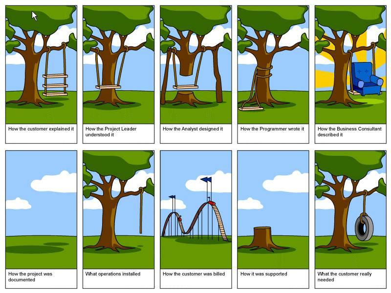
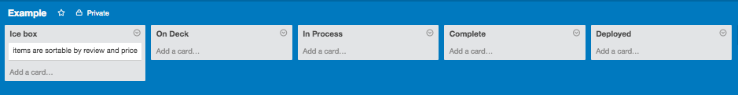

# Agile Teams
#### Overview
Agile development principles were created to bridge the gap between customers and developers during lengthy development cycles. The issue was that after requirements were delivered by the customer developers would go and work in isolation until delivering a working release...potentially weeks or months and tens of thousands of dollars into the development cycle (as represented by the image below).  

  

The idea was that a product owner from the developer side would interact as frequently as possible with the product owner on the client side to make sure that the requirement was being met. The developers PO would then communicate any changes to the req to the development team through a scrum master. The Scrum Master is in charge of maintaining the backlog of user stories the team draws from, prioritizing and de-prioritizing (backlog grooming) features based on where the team is in the product's development cycle, and communicating them to the team during a daily stand up (called a scrum).  

Typically team's implement new feature sets during period's of time called 'Sprints', typically one to two weeks. These are preceded by planning meetings and followed by review meetings. These entail essentially what you would expect, in planning meetings the feature(s) to be addressed are hashed out and the team gets on the same page. In review meetings the team addresses any problems they experienced with the team dynamic, any failures in implementation and adds or removes the corresponding stories from the backlog.  

#### Our Implementation
For our purposes we are going to utilize some aspects of the agile development methodology. You won't have an actual customer to interact with, but you can use us to clarify requirement by asking us questions about how we want features to work.  

On your side, you should assign a scrum master and only the scrum master should add or remove user stories from your kanban (we suggest that you use [Trello][trello]). During sprint planning meetings your scrum master should select one or more user stories, convert them into features and assign them to the team member who will own the feature. During the sprint, it is the team members responsibility to move their feature card through the kanban.  

  

##### Completeing Features
A feature is 'complete' when it works, it is 'finished' when it is merged into either development or production code, reviewed to ensure that it has not introduced bugs, and ultimately deployed in a working state to production. In the real world, these last steps are typically in the realm of the QA team. You don't have a QA team, so you will have to rely on good tests and frequent deployment to make sure that your features are working correctly.  

##### Standups
During the day you and your team need to have standups. These are fast checkins with team members to quickly declare status and reveal blocks (i.e. I am still working on implementing user login, I am blocked because I need a new database column for users to have passwords.). These should occur as regularly as you see fit (every hour would probably be too often, at least a few times a day should suffice). If you are working remotely from one another, you need to arrange standups on Skype, Hangout, or conference call. By convention these meetings last approximately one minute for each member involved and you actually stand up from where you are working to have them.  

##### Blocks
Because you are collaborating on a single code base it is important to be clear about what portion of code you are working in. The better you can compartmentalize the work each team member is doing, the better you can avoid merge conflicts. If you realize that what you are working on is dependent upon changing something in another part of the code, or on a feature someone else is responsible for, you may be blocked. Communicate you block during a stand up and have the scrum master prioritize the feature that will unblock you.  

##### Sprints
Usually sprints are specific lengths of time (one or two weeks is pretty standard). You don't have as much time for your project and you should adjust your sprints accordingly. Try to keep them to 2 days, and keep your planning and review meetings to under an hour (probably more like 30 minutes).  

### Wireframing
Before you write any code, you need to have a plan. Planning design requires creating a wireframe. Wireframes help you logically think through what goes where on a website. What content will be static? What parts are dynamic? How will users interact with menu items, content, articles, videos, images etc? Where will all of this content live and how will it be served?  

User Experience (UX) and User Interface (UI) are important to keep in mind. When you are building out the functionality of an application it is easy to think like a developer...but that's not how the application will be used, it's how it will be built while you are designing to create a product that will be useful, with a good flow, and not infuriate the user.  

[This resource][wireframing] gives a very thorough overview of wireframing...you probably don't need to go that deep in or use the listed software, but definitely draw a wireframe (by hand if necessary), get everyone up to speed, and send all of you team members a copy with notes on whatever you discussed.

##### Design Thinking
A popular modern methodology that fits in with Agile quite well is '[Design Thinking][design].' The core concept is to design and develop based not on what the client is asking for, but to develop what the client needs. Clients don't usually know what they want and they only way to determine what they need is to understand the underlying reason they are asking for help.  

[trello]:https://trello.com/
[wireframing]:http://webdesign.tutsplus.com/tutorials/a-beginners-guide-to-wireframing--webdesign-7399
[design]:http://www.fastcompany.com/919258/design-thinking-what
