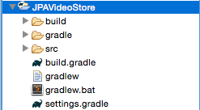
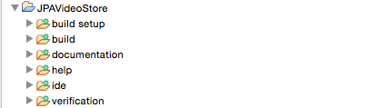
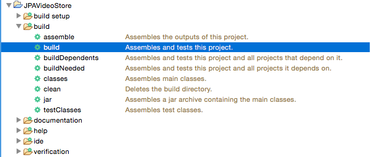
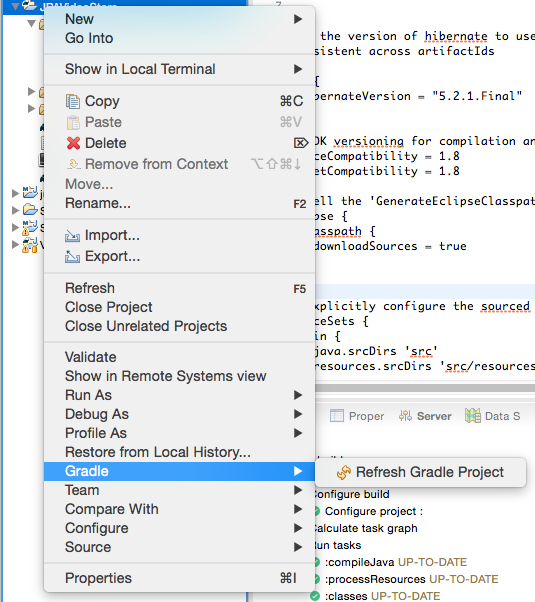

# Dependencies
* The dependencies and overall gradle build will be different for a JPA project vs what we have done with web applications.

* JPA requires several additional JAR files:

  * A JDBC driver to communicate with the database (MySQL).

  * A persistence provider that implements the JPA interfaces (Hibernate).

* We will also incorporate several optional libraries to improve JPA's performance:

  * A logging framework to control the persistence provider's output making it easier to debug (Log4J).

  * A connection pool library which will scale with production (c3p0).

    * Without c3p0, Hibernate's connections go to sleep after ~24 hours. If a user tries to access a sleeping connection pool, they will initially be served an error. To improve User Experience, c3p0 ensures that the connection pool remains open.

* We will be including these dependencies with Gradle.

### Hands On:
You are going to "Add a Gradle Nature" to your project and add dependencies to the *build.gradle* so that Gradle will include the necessary JAR files in the classpath.  

1: In Eclipse, right click on the *JPAVideoStore*'s project name in the *Project Explorer* and choose *Configure -> Add Gradle Nature*.  

  * Refresh your *Gradle Tasks* perspective, this should lead to *JPAVideoStore* becoming visible in the *Gradle Tasks* perspective.


2: Double click on the *init* task in the *Gradle Tasks* perspective under _JPAVideoStore -> build setup_


  * This will run the initialization tool on the project, and create the necessary Gradle build files.

  * Refresh your *JPAVideoStore* project (right click on the project and select *Refresh*) and these files should become visible. The newly created files should include:



3: Modify the newly created *build.gradle* file by adding the following configuration:


```groovy
apply plugin: 'java'
apply plugin: 'eclipse-wtp'

/*
name your project's dependency group and give it an initial version.
the 'artifactId' is assigned automatically based on the project's name.
*/
group = 'com.videostore'
version = '0.0.1-SNAPSHOT'

/*
 set the version of hibernate to use to keep your dependencies DRY and
 consistent across artifactIds
*/
ext {
  hibernateVersion = "5.2.1.Final"
}

// JDK versioning for compilation and generated bytecode
sourceCompatibility = 1.8
targetCompatibility = 1.8

// tell the 'GenerateEclipseClasspath' task how to generate the .classpath file
eclipse {
  classpath {
    downloadSources = true
  }
}

// explicitly configure the sourced files of the application for compilation
sourceSets {
  main {
    java.srcDirs 'src'
    resources.srcDirs 'src/resources'
  }
 }

// set query location for dependencies
repositories {
  mavenCentral()
}

// define project specific dependencies
dependencies {
  compile "mysql:mysql-connector-java:5.1.39"
  compile "log4j:log4j:1.2.17"
  compile "org.hibernate:hibernate-core:$hibernateVersion"
  compile "org.hibernate:hibernate-c3p0:$hibernateVersion"
}

```

4: Refresh your *Gradle Tasks* perspective, and you will see additional options:



5: From the *Gradle Tasks* perspective run the *build* from _JPAVideoStore -> build -> build_ (***NOTE***: You may need to refresh the perspective)  



  * Gradle will compile your Java code and place it in _build -> classes -> main -> yourpackagenames_ directories.
  * Gradle will also reach into the location indicated in the *repositories* task and extract the dependencies you indicated (or download/update if necessary)

6: Refresh the Gradle nature of the *JPAVideoStore* project by right clicking on the project, and then selecting _Gradle -> Refresh Gradle Project_



* Now all of your dependencies should be visible in _Project and External Dependencies_ and your compiled class files should be visible within their packages inside of the the build directory.

##### ***What is `ext { }` doing?***
  * If you have multiple dependencies from the same groupId, it is useful to ensure that they are of the same version (this decreases the likelihood of dependency hell)

  * In the example above, we are using a `ext { }` task to set a version of hibernate we wish to use for all of the hibernate dependencies.

  * This could also be useful if you had multiple Spring jars and wanted to ensure that they were all the same version.


[Previous](what_is_java_persistence.md) | [Next](creating_an_entity_class.md)
