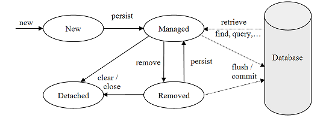

# Transactions and JPA
* Similar to *Java Database Connectivity (JDBC)*, writing to the database through the Java Persistence API requires a *Transaction* provided by the *EntityManager*

> #### Quick refresher on database transactions...
> A database provides a single source of truth (unless you have multiple instances...but we won't get into that), as a result, it is critical to preserve data integrity in the database. 

> Operations involving "reading" from the database (e.g. `SELECT * FROM payment;` in SQL or `em.find(Payment.class, 1);` in JPA) do not require transactions/commits as they are merely accessing information. Conversely, "writing" to the database involves altering/creating/deleting data, it is critical that these processes complete uninterrupted to preserve data integrity. Suppose an `INSERT` operation failed to complete because of an error, this could leave your database in an error state, or the data being written may be incomplete or compromised in some other way. For this reason it is critical to wrap "write" operations in transactions so that there is a saved rollback point and that no other operations interrupt the process.

* Surround JPA write operations with *Transaction*s retrieved from the *EntityManager*:

  * We will spend more time reviewing how to create objects soon, but the following example illustrates how a new *Customer* object could be persisted using a *Transaction* within a DAO:

```java
public class CustomerDAOImpl implements CustomerDAO {
  public Customer create(Customer customer) {
    EntityManagerFactory emf = 
        Persistence.createEntityManagerFactory("VideoStore");
    EntityManager em = emf.createEntityManager();

    // start the transaction
    em.getTransaction().begin();
    // write the customer to the database
    em.persist(customer);
    // update the "local" ("detached") 'customer' object
    em.flush();
    // commit the changes (actually perform the operation)
    em.getTransaction().commit();

    // return the full "managed" customer object
    return customer;
  }
}
```

# Managed vs. Detached Entities

* An entity can be either managed or detached.

  * Changing a managed entity will result in a change to the database upon a transaction commit (but not until the commit).

  * Whereas, changing a detached entity has no effect on the database.

  * This is confusing...let's look at an example:

```java
public class Example {
  public void illustrateManagedVsDetached() {
    EntityManagerFactory emf = 
        Persistence.createEntityManagerFactory("VideoStore");
    EntityManager em = emf.createEntityManager();

    // open a transaction
    em.getTransaction().begin();

    // create a "detached" customer entity
    Customer detachedCustomer = new Customer();

    // retrieve a "managed" customer entity
    Customer managedCustomer = em.find(Customer.class, 1);

    // update the values of the detached entity
    detachedCustomer.setFirstName("Nope");
    detachedCustomer.setLastName("Not Gonna Happen");

    // update the values of the managed entity
    managedCustomer.setFirstName("Will Update");
    managedCustomer.setLastName("On Commit");

    // actually make changes
    em.getTransaction().commit();
    // -> the detached entity's changes were not saved
    // -> the managed entity's changes HAVE been saved

  }
}
```



* When you retrieve your *EntityManager* from an *EntityManagerFactory*, then your `find()` or `createQuery()` methods return managed entities.

### Determining if Entities are managed
* The following can be used for complex logic in a DAO, most of the time, they will not be necessary.

* Call `EntityManager.contains()` to determine if a particular entity is managed or detached.

  * `contains()` returns true if the entity is managed.

* To detach an entity, pass it to *EntityManager*’s `detach()` method.

  * Call `EntityManager.clear()` method to detach all managed entities.

* Pass a detached entity to *EntityManager*’s `merge()` method to get back a managed version.

  * The passed in entity remains detached, but the returned object is managed.

* Call `EntityManager.refresh()` to reload data into an entity from the database replacing any pending changes.


[Previous](README.md) | [Next](creating_an_entity.md)
