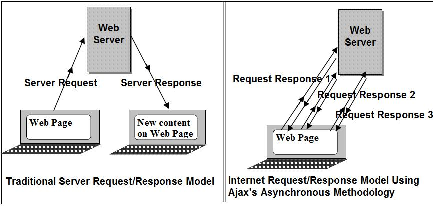

### Asynchronous JavaScript and XML (AJAX)
* The term Ajax was coined in 2005

* Ajax allows a web page to request information from a server, receive a response, and update the page without ever refreshing the page.

* Ajax is a term which describes a process that involves several technologies:
  * **Browser**: The browser is the home of the XMLHttpRequest object. We gain access to this object through the Web Api exposed by the global Window object. It was first introduced by Microsoft with Internet Explorer 5 and was named for the then popular usage of XML to communicate between applications.
  * **JavaScript**: JavaScript uses the interface provided by the Web Api to access the XMLHttpRequest object's functionality. JS first creates a request, dispatches it, and then uses DOM manipulation and callback functions to update the page with the resulting response.
  * **Web Server**: The server receives the request from the browser's XMLHttpRequest object and exposes access to some resource (such as database data, and sends a response usually as JSON or XML (although it can also send plain text, numeric status codes, or HTML).

* To understand this interaction, let's unravel the XMLHttpRequest object which ties it all together.

[Previous](README.md) | [Next](xhrObject.md)
