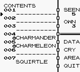

### Pokemon Index Lab

When we start making asynchronous applications it is imperative we understand DOM manipulation. Without sending the user to a new view we have to dynamically add and remove elements from the page. jQuery provides us with a number of tools that make this process easier.

1: Create two files, `app.js` and `index.html`. Your index page should include a single div with an id of content.  

```html
<div id='content'></div>
```

2: Create an ajax `GET` request to `http://52.25.225.137:8080/pokemon/data/poke?sorted=true`.  Test the route in Postman and see what data is being returned.  

3: Once this data is successfully obtained, parse it and render it to the browser on load in table format.  

```javascript
$(document).ready()
```

4: You will need to construct all the elements of the table dynamically, and append the finished table to the div (with id 'table') you created in your index.html.

* We want to display:
  * pokedexId  
  * name  



* Remember tables are made up of
```html
<table>
  <thead>
    <tr>
      <th></th>
    </tr>
  </thead>
  <tbody>
    <tr>
      <td></td>
    </tr>
  </tbody>
</table>
```

5: Apply Zebra striping to the table. (Rows should alternate between white and another color so viewers can easily distinguish content sections)

[Previous](lab.md) | [Next](pokemonShow.md)
