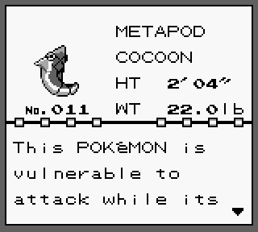

### Pokemon Show Lab

1: Once the table is complete add a click event listener to the `<td>` that contains the Pokemon's name.  

2: This click event should clear the DOM and render information specific to the Pokemon you clicked on.  

**Hint: you can embed the id of a Pokemon as a property of the `<td>` elementas you create them**

```html
<td pokeid="1">Bulbasaur</td>
```


3: Display the Pokemon's:  
  * image  
  * pokedex id  
  * name  
  * species  
  * height  
  * weight
  * description  

  

4: Add a return button to the bottom of the page that clears the DOM and displays the index table view again.  

[Previous](pokemonIndex.md) | [Next](ajax_put_post.md)
