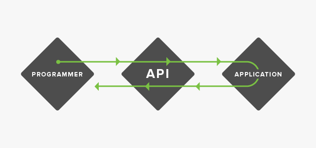

# RESTful Services with Spring :neckbeard:

### What is REST
A RESTful web service is an architecture based around the HTTP Protocol. GET/PUT/POST/DELETE are the common HTTP methods used with REST.

Machines communicate via URL's. REST provides a number of guidelines that help structure these URL's into a standardized format.

Just like with English, verbs play an important role in describing what action is going to take place. 'GET coffee' and 'MAKE coffee' yield two completely different actions.

These verbs (GET/PUT/POST/DELETE) can be paired with a noun based URL to provide a semantic, human readable URI that properly describes the resources you are accessing.

#### REST Fundamentals
* Client-Server
  * clients are not concerned with data storage (this remains internal to each server)
  * servers are not concerned with the user interface
  * both the server and the client may be completely replaced independently and the other would work in isolation
* Stateless
  * each request from client to server must contain all of the information necessary to understand the request and cannot take advantage of any stored context on the server. Session state is kept ENTIRELY on the client.
  * improves visibility, reliability and scalability
* Uniform interface
  * information is transformed in a standardized from instead of one that specifically fits the applications needs (there is an implicit tradeoff here)
  * Implementations are decouple from the services they provide.
  * REST is designed to be efficient for large-grain http data transfer, optimizing for the common case of the web, but resulting in an interface that is not optimal for other forms of architectural interaction.

### What is an API
Machines do not understand web pages. All the markup and styling is solely so that a human user can properly interact with a system. The machine only cares about data. Applications that deal solely with data are referred to as APIs.

API is short for Application Programmer Interface. These apps provide endpoints, URI's, that give a programmer access to data. The programmer can consume a resource via the specified URI and display this data to the user in their own application.

Once an API is configured, the service can be used by any application via the specifications set forth by the provider.

### REST vs MVC

* A RESTful web service **WILL**:

  * Use a standardized 'noun' based naming schema for its `@RequestMapping`
  * Follow the semantic HTTP Protocol for our RESTful services. Utilizing the extended vocabulary of GET/PUT/POST/DELETE
  * Respond to requests with a resource, typically data in JSON format

* A RESTful service will **NEVER**:
  * Respond with a view not associated with the manipulation of a resource (i.e. something other than a create or edit form)

* It is possible to have BOTH REST and MVC controllers in one Spring project. The REST controller will provide data which can be consumed by a view presented by an MVC controller. **NOTE**: These controllers should be completely separate, and your REST controller should not customize the presentation of data in anyway (this makes it as reusable and maintainable as possible).

[Previous](README.md) | [Next](configure_spring_rest.md)
