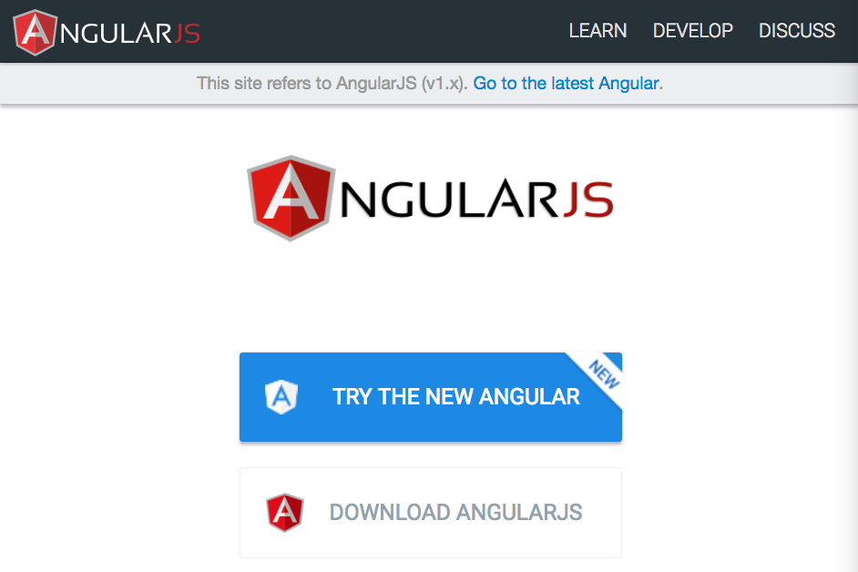
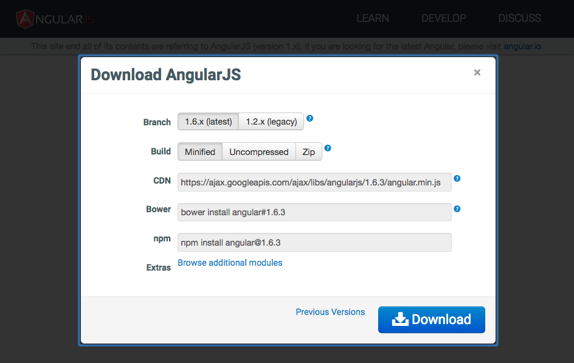
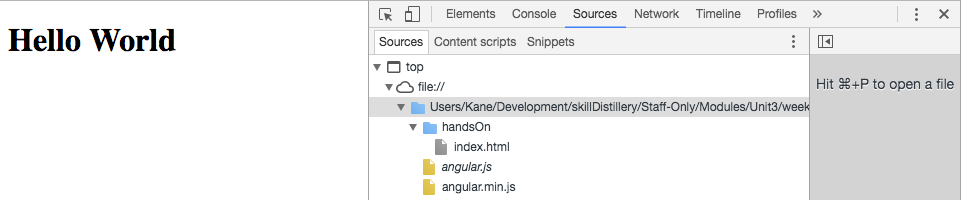

# Angular Dependency

* Just use the CDN! 

```
https://cdnjs.cloudflare.com/ajax/libs/angular.js/1.5.7/angular.min.js
```

* The core dependency for AngularJS is the Angular source code, a minified JavaScript file named ***angular.min.js***

* Current and previous versions of Angular can be found at https://angularjs.org > ***DOWNLOAD ANGULARJS*** 






### Spring Based Angular Applications

* Angular was designed to run effectively on its own without the need for complex and time consuming back end logic, as a way for front end developers to mock out the UI/UX and some functionality for applications independently.

* As a result, Angular can run essentially anywhere. It can be included on Wordpress sites, hosted on Apache web servers, etc etc.

* While Angular is powerful enough to provide application functionality without an MVC framework behind it, it can leverage the capabilities of a framework (like Spring) to become even more powerful.


### Hands On:

To get experience building an Angular application's structure, we need to make a dynamic web project for it to live in.

1: Create a new directory in your `SD` directory named 'ng' (ng is a short hand for Angular).

2: Initialize your `SD/ng` directory as a new STS workspace

3: 

a. Create a _New Dynamic Web Project_ and name it 'ngHandsOn'

b. Click _Next >_

c. Click _Next >_ again

d. Click _Generate web.xml deployment descriptor_

e. Click _Finish_

3: Modify the *web.xml* so that the `welcome-file-list` only contains `index.html`, e.g.:

```xml
  <welcome-file-list>
    <welcome-file>index.html</welcome-file>
  </welcome-file-list>
```


4: Go to https://code.angularjs.org/1.5.7/ and download the ***angular.min.js*** dependency and the ***angular.min.js.map*** file. Move both of these files into a directory *WebContent/js*.

Ultimately, your file structure should look like this:

```bash
WebContent
├── WEB-INF
│   ├── lib
│   └── web.xml
├── handson.html
├── index.html
└── js
    ├── angular.min.js
    └── angular.min.js.map
```

5: Add a basic html document definition to your ***index.html*** file:

```html
<!DOCTYPE html>
<html>
<head>
  <title>Hands On</title>
</head>
<body>
  <h1>Hello World</h1>
</body>
</html>
```

6: Use `<script src=""></script>` tags to import the ***angular.min.js*** file into your html document. ***NOTE***: You do NOT need to import the *angular.min.js.map* file, that file simply needs to be in the same directory as *angular.min.js*.

7: Open the document in Chrome, open developer tools, and check the *Sources* tab to ensure that your dependency is loaded.




#### [Prev](how_does_angular_work.md) | [Next](bootstrapping.md)
