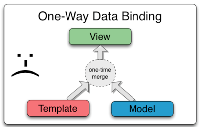
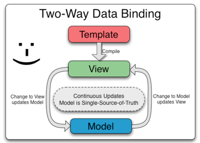

# Data Binding

* Angular truly excels at binding data between application logic and presentation.

* Previously we have used the *Model-View-Controller* pattern with SpringMVC to synchronously render data to templates and present them to the user.

* Most templating systems bind data in only one direction: they merge template and model components together into a view. After the merge occurs, changes to the model or related sections of the view are NOT automatically reflected in the view. Worse, any changes that the user makes to the view are not reflected in the model. This means that the developer has to write code that constantly syncs the view with the model and the model with the view.



* AngularJS templates work differently. First the template (which is the uncompiled HTML along with any additional markup or directives) is compiled on the browser. The compilation step produces a live view. Any changes to the view are immediately reflected in the model, and any changes in the model are propagated to the view. The model is the single-source-of-truth for the application state, greatly simplifying the programming model for the developer.



#### Example

```html
<!DOCTYPE html>
<html ng-app="">
  <head>
    <title>Example</title>
    <script src="angular.min.js"></script>
  </head>
  <body ng-init="fruitList = [];">

    <input type="text" ng-model="fruit">
    
    <input type="submit" value="Add Fruit"
      ng-click="fruitList.push(fruit); fruit = '';" />
    
    <ul>
      <li ng-repeat="f in fruitList">
        {{f}}
      </li>
    </ul>

    <input type="submit" value="Change First Fruit to Xylophone" ng-click="fruitList[0] = 'Xylophone';" />
    
  </body>
</html>
```

### Using Bindings with Expressions

* The previous example relies heavily on Angular's *Two Way Data Binding*. 

* In Angular *mustache* notation (`{{ }}`) is used to display values in the template. These are called 'bindings'. You can write any valid JavaScript *Expression* within the braces and the result will be rendered to the view. ***NOTE***: `undefined` will not be displayed, Angular's logic prevents `undefined` values from rendering.

* "Any valid JavaScript *Expression*"

  * Includes : 

    * Ternary operatores `{{ (1 > 2) ? "One" : "Two"; }}`

    * Math: `{{ 9 * 7 }}`

    * Strings : `{{ "Hello" + " World"}}`

    * Values from objects : `{{ person.name }}`

    * Values from array indices : `{{ fruits[0] }}`

  * DOES NOT Include :

    * functions

    * conditionals (switch / if-else)

#### HandsOn
In your `index.html`...

1: Notice that your `<h1>{{ 'Hello Angular' }}</h1>` is a String expression in an Angular binding. 

Create an unordered list, with 3 list items.

2: In each list item use a binding to render name of a movie to the template.

3: Create an `<h3>` which displays the value of `4 / 0` with a binding.

