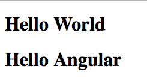

# Automatically Bootstrapping an Application

* 'Bootstrapping' an application tells Angular what to initialize in order to run an application.

* The [`ngApp`][ngapp] directive designates the ***root element*** of an application and compiles the HTML template (add Angular directives all over the place).

* To use the [`ngApp`][ngapp] directive, apply it to one of the top level HTML elements in your document (typically `<html>`):

```html
<!DOCTYPE html>
<html ng-app>
  <!-- ... -->
</html>
```

> ***Why is the [`ngApp`][ngapp] directive `ng-app` in markdown?***

> This is Angular's 'attribute normalization'. Typically, directives (ng*) are referred to by their camelCased JavaScript definition names (e.g. 'ngApp'), however, in order to account for case sensitivity in HTML the framework designers chose to normalize the representation of directives in HTML. This normalization converts directive names from camelCased to snake-cased. Thus, [`ngApp`][ngapp] becomes `ng-app`, `ngClick` becomes `ng-click` etc...etc...

* A document can only be automatically bootstrapped with [`ngApp`][ngapp] once. If additional [`ngApp`][ngapp] directives exist on a page they will be disregarded.

* If a document is not bootstrapped, Angular will not compile the HTML and will appear to not be working. (***HINT***: Remember this when you are debugging later)

### Hands On:

1: Use the `ng-app` directive to bootstrap the `<html>` element of your `index.html`

2: Use an Angular data binding `{{ }}` to display the value of the JavaScript expression 'Hello Angular' within an `<h1>` element:

```html
<!-- ... -->
  <h1>{{ 'Hello Angular' }}</h1>
<!-- ... -->
```



#### [Prev](angular_dependency.md) | [Next](directives.md)

[ngapp]:https://docs.angularjs.org/api/ng/directive/ngApp
