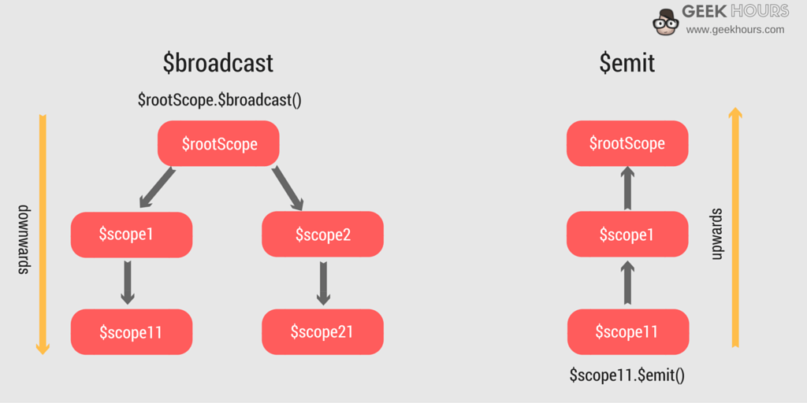

# Creating & Observing Events

* In AngularJS it is possible to both create and observe custom events.

* This can be extremely useful for updating values within the scope of isolated and unrelated components.

### Understanding Angular `$scope`

* Angular's *`$scope`* service is a representation of the values and enviroment available where it is injected:

```js
angular.module('exampleMod')
.component('example', {
  controller : function($scope) {
    // logic
  }
})
```

  * In the above code, the *`$scope`* service injected into the controller is unique to the component and is created when Angular *compiles* the template and binds it to the controller function.

* ***NOTE***: `$scope`s in Angular are an extremely confusing concept, for the sake of understanding events it is only important to understand that the injected `$scope` service into a component's controller is unique to that component and not representative of the global scope.

### `$rootScope`

* Every Angular application has a single `$rootScope`

* The `$rootScope` is the parent of all other angular `$scope`s

* `$rootScope` shares a heirarchical relationship with all other `$scope` and all other `$scope` inherit from `$rootScope`

* For simplicity, think of `$rootScope` as Angular's global scope.

### Sending Event Notifications Between `$scope`s

* In Angular events are observed with the `$scope` service.

* Events are either *`$broadcast`ed* or *`$emit`ted* between `$scope`s

  * `$emit` notifies `$scope`'s ***above*** the current `$scope` of an event
  
  * `$broadcast` notifies `$scope`'s ***below*** the current `$scope` of an event



  * ***NOTE***: For performance reasons, as well as simplicity we will only be using `$broadcast`

* Given that all `$scope` inherits from (and is thus connected to) `$rootScope` and that `$broadcast` propogates event notifications down the heirarchy, it is thus possible to notify all `$scope`s of an event from the `$rootScope`.

  * Example:

```js
angular.module('messager')
.component('newMessage', {
  templateUrl : `app/newMessage.component.html`,
  controller : function($rootScope, messageService) {
    var vm = this;

    vm.sendMessage = function(){
      vm.msg.timestamp = Date.now();
      messageService.sendMessage(vm.msg)
        .then(function(response) {
          // Use the $rootScope to $broadcast the event and send information
          $rootScope.$broadcast('newMessage', {
            message : vm.msg
          });
          vm.msg = {};
        });
    };
  },
  controllerAs : 'vm'
})
```

* As seen above, `$broadcast('name', {someData : values})` is a function:

  * The first argument is the name of the event to broadcast as a string
  * The second (optional) argument is an object of data to include with the notification

### Using `$on` to Listen for and React to Event Notifications
* Once an event is `$broadcast` from the `$rootScope`, the child `$scope`s can observe it by name with `$on`:

```js
angular.module('messager')
.component('messages', {
  templateUrl : `app/messages.component.html`,
  controller : function($scope, messageService) {
    var vm = this;

    vm.messages = [];

    var loadMessages = function(e,msg) {
      console.log(msg); // print the message that was sent with the $broadcast
      messageService.getMessages()
        .then(function(response) {
          vm.messages = response.data;
        });
    };

    loadMessages();

    // have this $scope listen for the 'newMessage' event and then call a callback function
    $scope.$on('newMessage', loadMessages);
  },
  controllerAs : 'vm'
})
```

* `$on('eventName', function(event, value){})` is a method on the `$scope` service which listens for events by name, and fires a callback function when an event is observed.
  * The first argument is the name of the event to listen for
  * The second argument is a function which tells `$on` what to do when the vent is observed
    * The callback function will be passed two arguments:
      * The event object
      * Any additional information passed with the event.

* Different components can apply different listeners for the same event using `$on`, and all of them will observe the `$broadcast` event:

```js
angular.module('messager')
.component('navigation', {
  templateUrl : `app/navigation.component.html`,
  controller : function($scope, messageService) {
    var vm = this;

    vm.messageCount = 0;

    var getMessageCount = function() {
      messageService.getMessages()
        .then(function(response) {
          vm.messageCount = response.data.length
        });
    };

    getMessageCount();

    // this component also listens for 'newMessage' events
    $scope.$on('newMessage', getMessageCount);
  },
  controllerAs : 'vm'
});
```

#### [Prev](README.md) | [Next](lab.md)