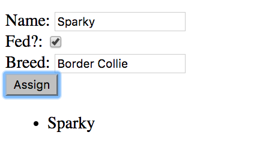
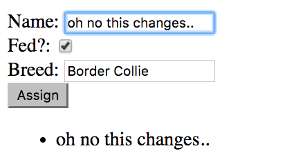
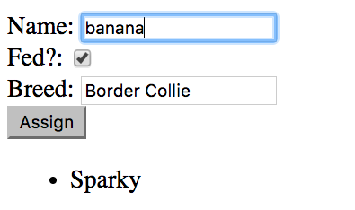

# `angular.copy(val)`

### The Problem
* When Angular's `ng-model` is used it creates a *two way data binding* to the object's value in memory. This means that if the value is modified by any variable referencing it, it will change the value of the object **everywhere**:

* Example:

```html
<!-- ex.component.html -->
<form>
  <label>Name: </label><input type="text" ng-model="vm.dog.name" /><br />
  <label>Fed?: </label><input type="checkbox" ng-model="vm.dog.hasBeenFed" /><br />
  <label>Breed: </label><input type="breed" ng-model="vm.dog.breed" /><br />
  <input type="submit" value="Assign" ng-click="vm.assignDogToKennel(vm.dog)" />
</form>

<ul>
  <li>{{vm.kennel.dog.name}}</li>
</ul>
```

```js
// ex.component.js
angular.module('exampleModule')
.component('exComponent', {
  templateUrl : 'app/exampleModule/exComponent/ex.component.html',
    controller : function() {
      var vm = this;
      
      vm.kennel = {
      };
            
      vm.dog = {
          name : 'Sparky',
          hasBeenFed : true,
          breed : 'Border Collie'
      };
      
      vm.assignDogToKennel = function(msg) {
        vm.kennel.dog = msg;
      };
            
    },
    controllerAs : 'vm'
});
```

* Initially this code works as expected, assigning the dog object to the `dog` property of the `vm.kennel` object.



* However, there is still a *deep reference* to the `vm.dog` object contained within the object assigned to `vm.kennel.dog`. This means that changes to the `vm.dog` object will also be reflected in the `vm.kennel.dog` object.



### The Solution

* `angular.copy(val)` creates and returns a copy of the object provided as an argument.

```js
angular.module('exampleModule')
.component('exComponent', {
  templateUrl : 'app/exampleModule/exComponent/ex.component.html',
    controller : function() {
      var vm = this;
      
      vm.kennel = {
      };
            
      vm.dog = {
          name : 'Sparky',
          hasBeenFed : true,
          breed : 'Border Collie'
      };
      
      vm.assignDogToKennel = function(msg) {
        vm.kennel.dog = angular.copy(msg);
      };
            
    },
    controllerAs : 'vm'
});
```

* With `angular.copy(val)` you can avoid the deep reference issue illustrated above:




### Hands On

1: Modify the behavior you created in the previous hands on to add a copy of the product object to the product list (instead of the deep reference to the original object).

2: If you want to reset the form, you can reset the value of the `product` ng-model after the behavior in the click event. Remember, the value assigned to an attribute directive is a JavaScript expression. You can chain multiple expressions by semi-colon seperating them. The following example resets the `product` ng-model to an empty object. 

```html
<input type="submit" value="Add Item" ng-click="vm.addProduct(product); product = {};"/>
```

#### [Prev](ng-model.md) | [Next](lab.md)