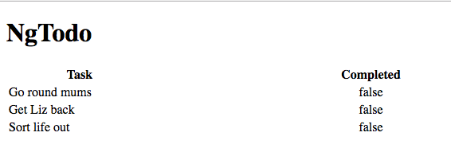
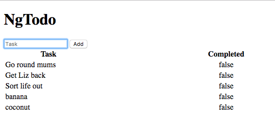
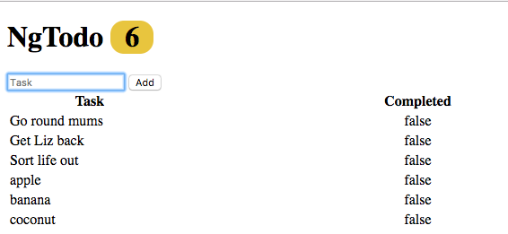
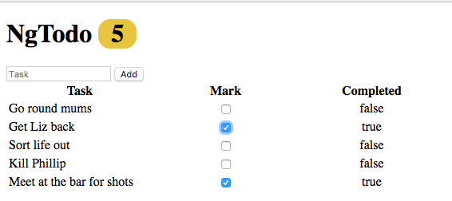

# Lab

### Part 1 : Display Content



1: Add an array of 'todo' objects to your `todoList.component.js` controller similar to the one below:

```js
    vm.todos = [
      {
        id : 1,
        task : 'Go round mums',
        description : '',
        completed : false
      },
      {
        id : 2,
        task : 'Get Liz back',
        description : '',
        completed : false
      },
      {
        id : 3,
        task : 'Sort life out',
        description : '',
        completed :  false
      }
    ];
```

2: In `todoList.component.html` create a table and use `ng-repeat` to create rows that display each of the 'todo' objects' task and whether or not it has been completed.

3: In `todoList.component.html` add an `<h1>` with a title for your application.

### Part 2 : Add New Todos



1: In `todoList.component.html` add a form which takes in a new task and assigns it to a 'todo' `ng-model` object.

2: Assign the submit button an `ng-click` like `vm.addTodo` and pass it the `ng-model` as an argument. You can also zero the `ng-model` by reassigning it to an empty object on the click.

3: In `todoList.component.js` create the *behavior* `vm.addTodo`. The behavior should have one 'todo' parameter which represents the 'todo' `ng-model` object provided as an argument. Set the todo object's 'id' using this function:

```js
var generateId = function() {
  return vm.todos[vm.todos.length-1].id + 1;
}

// note, once we have a database this won't be an issue 
// so this is good enough for now
```

* set the 'completed' property to `false` and the 'description' property to an empty string `''`. Finally, add it to the `vm.todos` array. 

### Part 3 : Display Todo Count



1: Create a behavior that returns the number of todos in the `vm.todos` array.

2: Use the behavior next to the text in the `<h1>` to display the number of todos in the list.

### Part 4 : Bind a Checkbox to the Todo's `completed` property



1: In `todoList.component.html` add a column to the table between 'Task' and 'Completed' called 'Mark'. 

2: Add an checkbox input for each row. Use `ng-model` to bind the todo's completed property to the checkbox.

3: Refresh your browser and test that it works. Now, when you toggle the checkbox, it should change the value of the completed property.

#### [Prev](angular-copy.md) | [Next](../ch4-more-component-practice/README.md)
