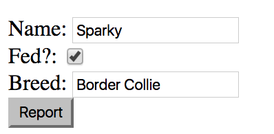
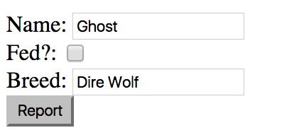

# [`ngModel`][ngmodel]

* `ng-model` is an attribute directive which can be used to bind `<input>` data to a property in the scope. 

* `ng-model` can both *create* AND *expose* data.
  
### 'Creating' Model Data with `ng-model`

  * `ng-model` can *create* data by creating an object within a form and use inputs to assign properties to the object

  * Example:

```html
<!-- ex.component.html -->
<form>
  <input type="email" ng-model="user.email" />
  <input type="password" ng-model="user.password" />
  <input type="submit" value="Login" ng-click="vm.login(user)" />
</form>
```

  * The *email* and *password* inputs values are bound to some 'user' object's properties. *On click*, the `vm.login(user)` behavior sends that 'user' object as an argument to the function.

```js
// ex.component.js
angular.module('exampleModule')
.component('exComponent', {
  templateUrl : 'app/exampleModule/exComponent/ex.component.html',
    controller : function() {
      var vm = this;
            
      vm.login = function(user) {
        console.log(user);
      };
      
    },
    controllerAs : 'vm'
})
```

### 'Exposing' (*binding*) Model Data with `ng-model`

  * `ng-model` can also *expose* data by binding an object's data from the controller to form inputs in the template (this is useful for tasks like editing).

```html
<!-- ex.component.html -->
<form>
  <label>Name: </label><input type="text" ng-model="vm.dog.name" /><br />
  <label>Fed?: </label><input type="checkbox" ng-model="vm.dog.hasBeenFed" /><br />
  <label>Breed: </label><input type="breed" ng-model="vm.dog.breed" /><br />
  <input type="submit" value="Report" ng-click="vm.reportDogStatus()" />
</form>
```


```js
// ex.component.js
angular.module('exampleModule')
.component('exComponent', {
  templateUrl : 'app/exampleModule/exComponent/ex.component.html',
    controller : function() {
      var vm = this;
            
      vm.dog = {
          name : 'Sparky',
          hasBeenFed : true,
          breed : 'Border Collie'
      };
      
      vm.reportDogStatus = function() {
      console.log(vm.dog);  
      };
            
    },
    controllerAs : 'vm'
});
```



  * *Clicking* on the 'Report' button:

```bash
# Console
Object {name: "Sparky", hasBeenFed: true, breed: "Border Collie"}
```

* Additionally, the binding is *two-way*, meaning, if you update the data in the view, it automatically updates the value in the controller.



```bash
# Console
Object {name: "Ghost", hasBeenFed: false, breed: "Dire Wolf"}
```

* As you change the values represented by the form, the originating data (controller property value) will be updated.

### Hands On

We will create a way to add a new product to the list of products in the controller. Additionally, we will alter our data, instead of an array of strings, we will use an array of objects.

0: replace your array with this one:

```js
[
  {
    name : 'Oh, The Places You\'ll Go!',
    price : 11.39,
    imgUrl : 'https://images-na.ssl-images-amazon.com/images/I/518eq5NjZkL._SY160_.jpg',
    rating : 5
  },
  {
    name : 'The Giving Tree',
    price : 8.31,
    imgUrl : 'https://images-na.ssl-images-amazon.com/images/I/51XKHozHPEL._SY160_.jpg',
    rating : 4
  },
  {
    name : 'Pete the Cat: Big Easter Adventure',
    price : 7.29,
    imgUrl : 'https://images-na.ssl-images-amazon.com/images/I/61VqwEXgCdL._AC_US218_.jpg',
    rating : 4
  },
  {
    name : 'Harry Potter and the Chamber of Secrets',
    price : 8.99,
    imgUrl : 'https://images-na.ssl-images-amazon.com/images/I/51PFoq3WlaL._AC_US218_.jpg',
    rating : 5
  }
]
```

1: Modify the list item in `productList.component.html` to display the `name` of the object.

2: Add the following form to your html:

```html
<form>
  <input type="text" placeholder="Name" /><br />
  <input type="text" placeholder="Price" /><br />
  <input type="text" placeholder="Image URL" /><br />
  <input type="number" placeholder="rating" /><br />
  <input type="submit" value="Add Item" />
</form>
```

3: Assign the 'text' and 'number' inputs `ng-model` attirbutes which assign properties that correspond to a product object (e.g. `name, price, imgUrl, rating`).

4: Create a controller behavior which takes an object and adds it to the product list array.

5: Assign the behavior to the 'Add Item' submit button, and pass it the ng-model product.

6: Refresh your browser, enter some values for the form fields, and click the button. You should see the new item's name appear in the list. You should also see the 'Number of Products' number increase by one. What happens if you add another product (it might not be totally obvious, check the console)?


#### [Prev](events.md) | [Next](angular-copy.md)


[ngmodel]:https://docs.angularjs.org/api/ng/directive/ngModel