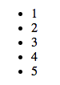
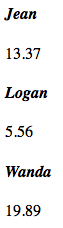

# `ngRepeat` Directive

### What is a [Directive][directive]?

* *Directives* are markers in the DOM. These can be HTML elements, element attributes, and occasionally classes and comments.

* When Angular bootstraps your HTML, the Angular HTML compiler traverses the DOM looking for these *directive* markers. When the compiler finds a *directive*, it attaches additional functionality to it using JavaScript. 
  
  * Some directives have to do with presentation. For example, [`ng-show`][show] and [`ng-hide`][hide] determine whether or not to render content to the DOM based on some JavaScript expressions validity:

```html
  <div ng-show="(2+2) === 4 ? true : false;">
    <ul>
      <li>Math is real.</li>
    </ul>
  </div>
```

  * `ng-show` is known as an *attribute* directive. It decorates a HTML element as an attribute.

  * The value assigned to `ng-show` above `"(2+2) === 4 ? true : false;"` is a JavaScript expression. That value will be parsed as JavaScript at runtime, and evaluate to `true`. Thus, the div and it's contents will be visible.

### [`ngRepeat`][repeat]

* `ngRepeat` is a very powerful directive which iterates over a list and repeats the same HTML content for each element.

* `ngRepeat` is an *attribute* directive, and is used to decorate an HTML element which you would like to repeat.

* Example:

```html
<ul>
  <li ng-repeat="num in [1,2,3,4,5]">{{num}}</li>
</ul>
```



  * The `ngRepeat` directive is applied to the HTML element you wish to repeat.

  * The expression provided to the directive takes the format of `alias in array` where 'alias' is whatever name you want to give to an individual value in the collection.

* `ngRepeat` becomes massively powerful when paired with a value from a component's *controller*

* Example:

```js
// tx.component.js
angular.module('appModule')
.component('txComponent', {
  templateUrl : 'tx.component.html',
  controller : function() {
    var vm = this;
    
    vm.transactions = [
      {
        amount : 13.37,
        purchaser : 'Jean'
      },
      {
        amount : 5.56,
        purchaser : 'Logan'
      },
      {
        amount : 19.89,
        purchaser : 'Wanda'
      }
    ]
  },
  controllerAs : 'vm'
})
```

```html
<!-- tx.component.html -->
<div ng-repeat="tx in vm.transactions">
  <h4>
    <i>{{tx.purchaser}}</i>
  </h4>
  {{tx.amount}}
</div>
```



* By combining data from a controller with `ngRepeat` you can dynamically display each of the items in your list with complex HTML. The best part is, you get to write HTML (not convoluted JS logic), and you only need to write it once.

### Hands On

1: In `productList.component.html`, remove all of the list items in your product list.

2: Create a new list item in the product list, use the `ng-repeat` directive to display each of the items in `vm.list` dynamically. 

  * ***REMEMBER***: You modify the element you want to repeat with `ng-repeat`.


#### [Prev](controllers.md) | [Next](behaviors.md)

[directive]:https://docs.angularjs.org/guide/directive
[show]:https://docs.angularjs.org/api/ng/directive/ngShow
[hide]:https://docs.angularjs.org/api/ng/directive/ngHide
[repeat]:https://docs.angularjs.org/api/ng/directive/ngRepeat