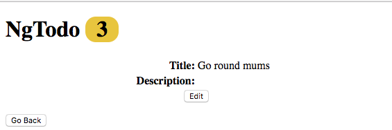
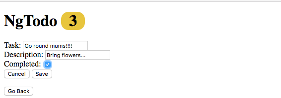
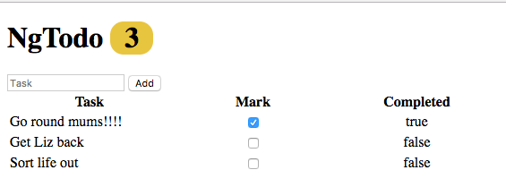

# Lab
An easier way of accomplishing this lab would be to use routing (which we will use later), however, there is overhead to that, namely, frequent roundtrips to the server which would take time.

You will be implementing a show view as well as an edit view. The edit will only take effect if a 'Save' button is clicked. This is beneficial as it consolidates trips to the server to the times when the user has indicating that data actually needs to change (as opposed to constantly).

### Part 1 : Adding a Show View



```bash
├── js
│   ├── angular.min.js
│   └── angular.min.js.map
├── app
│   └── appModule
│       ├── app.module.js
│       ├── todoList.component.html
│       └── todoList.component.js
└── index.html
```
<!-- FIX THIS -->
1: In `todoList.component.js` create a controller property named `vm.selected` and initialize it to `null`. We are going to add a detail view for a component when the user selects it.

2: In `todoList.component.html` create a `div`, inside of this div, create a detail view of the `todo` stored in `vm.selected` (i.e. bind `vm.selected`'s properties within the `div`).

3: Now we need a way of determining which todo to display in the detail view. Add an `ng-click` to each task in the table. Assign the `ng-click` a callback named `vm.displayTodo(todo)`. When a task is clicked on, set `vm.selected` to that `todo` object.

5: At this point when you click on a task, you should see the `todo` displayed in the detail `div` you created in step 2.

* it would be better if when something was clicked on, only the detail `div` was visible, and that until something was clicked on, the detail `div` was not visible.

* in `todoList.component.html` add an `ng-show` directive (https://docs.angularjs.org/api/ng/directive/ngShow) to the detail `div` component and assign it `vm.selected`

* in `todoList.component.html` add `ng-hide` directives (https://docs.angularjs.org/api/ng/directive/ngHide) to the `<table>` and the `<form>`, assign the `ng-hide` directive `vm.selected`.

6: Now it would be useful to have a way to make the table visible again.

* in `todoList.component.js` create a behavior named `vm.displayTable` which sets `vm.selected` to `null`.

  * this will make the table visible again, and make the detail `div` hidden (`null` is falsey)

7: in `todoList.component.html` assign the `vm.displayTable()` function to a button within the detail `div`.

### Part 2 : Adding an Edit Form & Save



Now we are going to add the ability to edit an individual todo from the detail `div`.

1: create a behavior named `vm.setEditTodo()`.

  * this behavior should make a copy of the `vm.selected` (use `angular.copy`) and assign it to `vm.editTodo`

2: in the detail `div` add an 'Edit' button with an `ng-click` directive.

* when the button is clicked call `vm.setEditTodo()`

3: in `todoList.component.html` create a form to edit the task, description and completed properties of a todo. Use `ng-model` to bind each input to the appropriate property on `vm.editTodo`.

* Create two buttons for the form, 'Cancel' and 'Save'

4: Modify the details div's `ng-show` and hide the `div` if `vm.editTodo` is truthy.

5: Assign the form an `ng-show` and make it visible if `vm.editTodo` is falsey.

Now if you click the 'Edit' button, the displayed content should disappear and the form should become visible.

6: The 'Cancel' button will make the edit form invisible and reset the todo to be edited (to `null`). Assign the button an `ng-click`, and when the button is clicked, set `vm.editTodo` to `null`.

7: The 'Save' button will update the data in the array, hide the form, and reset the todo to be edited to `null`.

* In `todoList.component.js` create a behavior named `vm.updateTodo(todo)`. This behavior will take a single parameter (a todo to use for the update)

  * for now, log the received todo to the console.

  * Modify `vm.updateTodo(todo)` to find the todo (by id) in the array of todos, modifying the values for that todo in the array. Then set `vm.editTodo` to `null`. 

* Last but not least, assign the `vm.updateTodo(todo)` behavior as a callback when the 'Save' button is clicked.


#### [Prev](README.md) | [Next](../ch5-services/README.md)