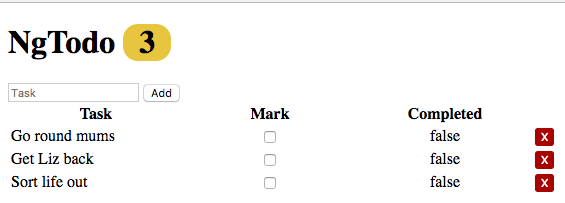

# Lab

### Part 1 : Refactor Data Into a Service

1: Create a 'todoService' in `todo.service.js`:

```bash
.
├── WEB-INF
│   └── web.xml
├── css
│   └── app.css
├── js
│   ├── angular.min.js
│   └── angular.min.js.map
├── app
│   ├── appModule
│       ├── app.module.js
│       ├── todo.service.js
│       ├── todoList.component.html
│       ├── todoList.component.js
└── index.html
```

Don't forget to source `todo.service.js` in the index.html

2: Inject 'todoService' into the 'todoList' component's controller

3: In 'todoService':

* create `var todos` and assign it the array from `todoList.component.js`

* re-assign `vm.todos` an empty array

* create a public `index()` method in 'todoSerice' which returns the array of todos.

* in `todoList.component.js` use the `todoService.index()` method to assign the todos to `vm.todos`

--> Test your application, the list should still display the same as before.

4: In 'todoService':

* make a public `create(todo)` method.

  * don't forget to move the `generateId` method over to the service as well.

* in `todoList.component.js` use the `todoService.create(todo)` method within the `vm.addTodo` behavior.

* now you will need to update the local array (`vm.todos`)

5: In 'todoService':

* make a public `update(todo)` method.

* in `todoList.component.js` use the `todoService.update(todo)` method within the `vm.updateTodo` behavior.

* remember, you will need to update the local array

### Part 2 : Add Destroy Functionality


You will add a button to each of the todo rows which, when clicked, will delete that todo.

1: In 'todoService':

* make a public `destroy(id)` method. The method will iterate over the todos array looking for the provided id. If the id is found, use splice to remove the todo at that index.

2: In `todoList.component.js` add a `vm.deleteTodo(id)` behavior that uses the 'todoService' to remove a todo by the provided id.

* remmeber, you will need to update the local array.

3: Add a delete button to each row in `todoList.component.html`, use an `ng-click` and pass the `vm.deleteTodo` behavior the id from the todo.


#### [Prev](di.md) | [Next](../ch6-http/README.md)
