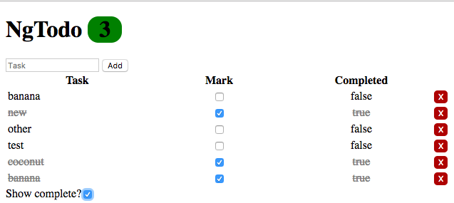
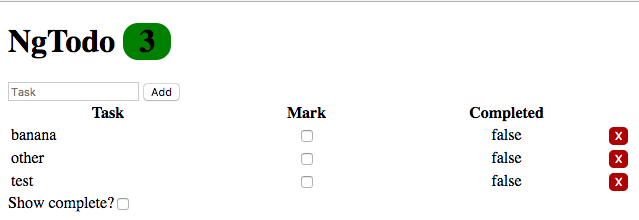

# Lab
### Part 1 : Modify `todoService.update()` to also update the `completeDate` property

1: in `todoService.update`, if the todo is complete, use this snippet to generate a date as a string and assign it to the 'completeDate' property:

```js
$filter('date')(Date.now(), 'MM/dd/yyyy'); // 8/24/1999
```

  * The above code snippet apply's the function returned from Angular's 'date' *filter* to the `Date.now() // 1493036979057` value and formats it to the string (`'MM/dd/yyyy'`). This is how you apply Angular's filters outside of the view. We will be using filters in the next chapter it made more sense to do this now.

    * `$filter('filterName')` is a getter that retrieves the *filter* function identified by that name from Angular.

    * The second set of parentheses (`(Date.now, 'MM/dd/yyyy')`) is the argument being passed to the returned function.

    * If this filter were being applied in the template, it would look like this:

```html
<div>{{vm.someDateValue | date:'MM/dd/yyyy'}}</div>
```

  * ***NOTE***: You also need to inject the `$filter` service into your `todoService`

* if the todo is incomplete, assign the 'completeDate' property `""`.

### Part 2 : Make a filter to only show incomplete todos

* Create a `incomplete.filter.js`

* This filter will be applied to the list of todos. (the array of values passed to it will be the collection of todos from your API)

* If a todo is *incomplete*, display it.

### Part 3 : Display a count of incomplete todo

* As in Part 1, inject the `$filter` service into your `todoList` component.

* Retrieve the `incomplete` filter by name, and use it to reduce the list of todos to only those that are incomplete.

* Modify your `vm.countTodos` method with the filter, display the count of only completed todos.

### Part 4 : Create an option to display ALL todos (even completed ones)

* In `todoList.component.html` add a checkbox assign it an `ng-model` `vm.showComplete`.

* Modify your `incomplete` filter. Create a parameter for a boolean (as a second parameter). If the boolean is true, return the full list of todos (both complete and incomplete).

* Include `vm.showComplete` as an argument to the filter on your list of todos in `todoList.component.html`.

* When the checkbox is clicked, it will display completed todos (in addition to incomplete ones).

### Part 5 : Warn the user if there are too many incomplete todos



* Using [`ng-class`][class], give the user a visual aid informing them if there is a large back log of todos. Change the color of the background surrounding the number of incomplete todos.

  * if there are more than 10 incomplete, make it red

  * if there are 5 or more, make it yellow

  * if there are less than 5, make it green


### Part 6 : Strike and grey out completed todos



* Use [`ng-class`][class] to modify the text of a todo row that is complete.

* If the todo's `completed` property is true, make the text color grey, and put a line through the todo.


#### [Prev](ng-class.md) | [Next](../ch8-routing/README.md)

[class]:https://docs.angularjs.org/api/ng/directive/ngClass
