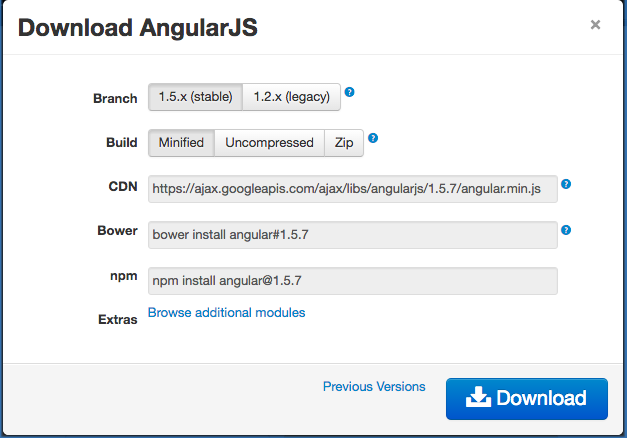

# `$ngRoute` Module

* Use the CDN:

```
https://cdnjs.cloudflare.com/ajax/libs/angular.js/1.5.7/angular-route.min.js
```

* In order to route with Angular, we need to inject the `$ngRoute` module as a dependency, and in order to gain access to the `$ngRoute` module, we need to download it's dependency from [AngularJS.org][ng].
  
* Go to Angular's website, click the blue button, and select 'Browse additional modules' link:
  

  
* [Which will take you to this resource page.][ngresources]
  
* Download the 'angular-route.min.js' file, this is the dependency we need.
  
* In order to include the `$ngRoute` module in your application, add it by name to your main application modules dependency array:
  
```javascript
angular.module('appModule', ['ngRoute'])
```
  
* Don't forget to import the file in your 'index.html':
  
```html
<script src="angular-route.min.js"></script>
```
  
* Now you will have access to the `ngRoute` dependency.
  
#### [Prev](README.md) | [Next](config.md)

[ng]:https://angularjs.org/
[ngresources]:https://code.angularjs.org/1.5.7/
