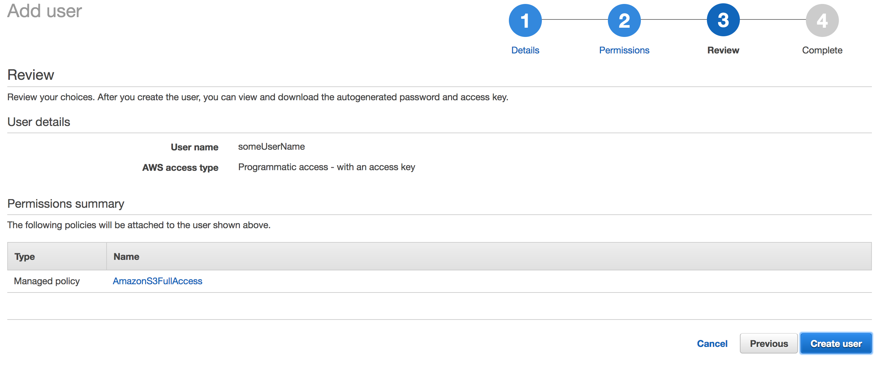
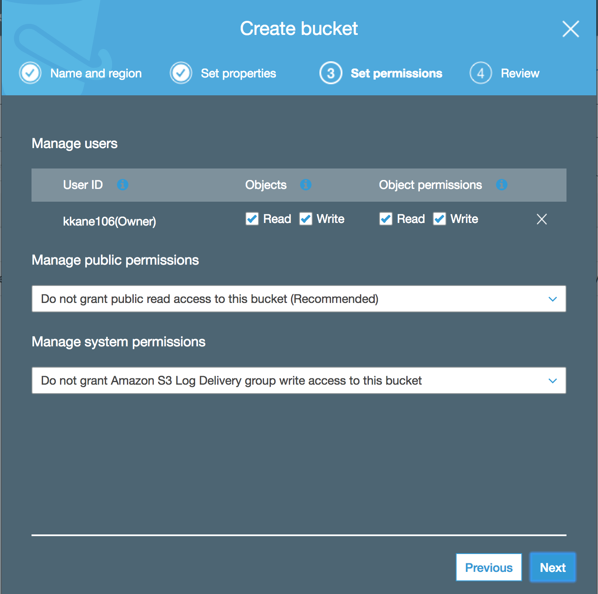

# AWS S3 Setup

### AWS Console - Configuring an S3 User and Bucket
0: Sign into AWS Console

1: From the top navigation, go to 'My Security Credientials'


2: Select 'Get Started With IAM User'


3: Add a new User


4: Configure the user by adding a username and selecting 'Programmatic Access'


5: Add the S3 permissions stereotype


6: Review that things look good



7: On this page you will be able to see your actual keys (and only here...so this is the time to grab them)


8: Go to the S3 service


9: Click "Create Bucket"


10: Name your Bucket


11: Configure bucket (we aren't going to do anything here)


12: Set user permissions for your account



13: Review your Bucket


14: Look in awe of your awesome new Bucket


### Application Dependencies

```groovy
  // AWS SDK
  compile group: 'com.amazonaws', name: 'aws-java-sdk', version: '1.11.171'

  // Servlet Dependencies
  compile group: 'javax.servlet', name: 'javax.servlet-api', version:'3.1.0'
  compile group: 'javax.servlet', name: 'jstl', version:'1.2'

  // Hibernate Validation
  compile group: 'org.hibernate', name: 'hibernate-validator', version:'5.2.4.Final'

  // Spring Dependencies
  compile group: 'org.springframework', name: 'spring-webmvc', version:"$springVersion"
  compile group: 'org.springframework', name: 'spring-orm', version:"$springVersion"
  compile "org.springframework:spring-tx:$springVersion"
  compile group: 'org.springframework', name: 'spring-web', version: '3.0.4.RELEASE'
  compile group: 'org.springframework.security', name: 'spring-security-core', version: '4.1.2.RELEASE'
  compile "org.springframework:spring-test:$springVersion"

  // Apache - File Upload Dependencies
  compile group: 'commons-io', name: 'commons-io', version: '2.5'
  compile group: 'commons-fileupload', name: 'commons-fileupload', version: '1.3.2'

  // Jackson REST Dependencies
  compile group: 'com.fasterxml.jackson.core', name: 'jackson-core', version: '2.8.1'
  compile group: 'com.fasterxml.jackson.core', name: 'jackson-databind', version: '2.8.1'
  compile group: 'com.fasterxml.jackson.core', name: 'jackson-annotations', version: '2.8.1'
```

### .gitignore && Application Properties File
* ***CREATE A `.gitignore` FILE AND INCLUDE YOUR PROPERTIES FILE WITH YOUR KEYS IN IT BEFORE YOU EVEN CREATE THE FILE!!!!!***

```bash
# .gitignore
# IGNORE YOUR PROPERTIES FILE OR THE WORLD WILL USE YOUR SECRET KEYS TO
# STORE KIDDY PORN AND IT WILL BE YOUR FAULT
s3.properties
```

* Now you can create an `s3.properties` file in your `src` directory.

```bash
# s3.properties
aws_access_key_id=YOUR_KEY_ID_GOES_HERE_NO QUOTES
aws_secret_access_key=YOUR_SECRET_KEY_GOES_HERE_NO QUOTES
aws_namecard_bucket=YOUR_BUCKET_NAME_GOES_HERE_NO QUOTES
```

* On application load, this file will be read into memory and these variables (called *environment* variables) will be available in your application

### Servlet Configuration
* The following 4 beans are needed to upload files, load environment variables, and configure a connection to AWS.

```xml
  <!-- additional configuration excluded for brevity -->

  <!-- This is how you can upload files -->
	<bean id="multipartResolver"
		class="org.springframework.web.multipart.commons.CommonsMultipartResolver">
		<property name="maxUploadSize" value="10000000" />
	</bean>

	<!-- This loads the .properties file(s) by name -->
	<bean
		class="org.springframework.beans.factory.config.PropertyPlaceholderConfigurer">
		<property name="locations">
      <list>
        <value>classpath:s3.properties</value>
        <!-- <value>classpath:rds.properties</value> -->
      </list>
    </property>
	</bean>

	<!-- This creates a credentials object from the .properties file values -->
	<bean id="s3Credentials" class="com.amazonaws.auth.BasicAWSCredentials">
		<constructor-arg type="String" value="${aws_access_key_id}" />
		<constructor-arg type="String" value="${aws_secret_access_key}" />
	</bean>

	<!-- This creates an actual client using the credentials above -->
	<bean id="amazonS3Client" class="com.amazonaws.services.s3.AmazonS3Client">
		<constructor-arg type="AWSCredentials" ref="s3Credentials" />
	</bean>

</beans>
```

### S3 Service

* The following is an example of an S3 Service which will communicate with Amazon S3 to upload and remove files.

```java
public interface S3Service {
	public String uploadFileToS3(String fileName, File file);
	public boolean deleteFileFromS3(String key);
}
```

```java
package services;
// I left these imports here so that you will understand where some methods
// are coming from
import com.amazonaws.AmazonServiceException;
import com.amazonaws.services.s3.AmazonS3;
import com.amazonaws.services.s3.model.AmazonS3Exception;
import com.amazonaws.services.s3.model.Bucket;
import com.amazonaws.services.s3.model.CannedAccessControlList;
import com.amazonaws.services.s3.model.ObjectListing;
import com.amazonaws.services.s3.model.PutObjectRequest;
import com.amazonaws.services.s3.model.S3ObjectSummary;

@Service
public class S3FileManager implements S3Service {

  // from the bean
	@Autowired
	private AmazonS3 s3;

  // generates unique key names for uploaded images
	@Autowired
	private UniqueS3KeyGenerator keyGen;

  // loads environment variable by name dynamically from .properties file
	@Value("${aws_namecard_bucket}")
	private String bucketName;

	@Override
	public String uploadFileToS3(String fileName, File file) {
    // generate a unique key for file for user
		String fileKey = keyGen.generateKey(fileName);
		try {
      // upsert image to s3
			s3.putObject(
				new PutObjectRequest(
					this.bucketName, fileKey, file
				)
				.withCannedAcl(CannedAccessControlList.PublicRead)
			);

		} catch (AmazonServiceException e) {
			e.printStackTrace();
			return null;
		}
    // return the url for the file with key
		return getUploadURL(fileKey);
	}

	@Override
	public boolean deleteFileFromS3(String fileName) {
		try {
      // delete request to s3
			s3.deleteObject(this.bucketName, fileName);
			return true;
		} catch(AmazonServiceException e) {
			e.printStackTrace();
			return false;
		}
	}
}
```

### S3 DAO - Store Files Association to User in Database
* Storing things in the cloud is useful, but an s3 bucket is just a grab bag of files, how they are associated with your application functionality is dictated by your application.

* In this example, after files are stored in the cloud, they are also associated with users in the application database.

```java
public interface S3ImageDAO {
	public S3Image create(File file, User user, String fileName, String title, String description);
	public Collection<S3Image> getImagesForUserWithId(int uid);
}
```

```java
@Transactional
@Repository
public class S3ImageDAOImpl implements S3ImageDAO {

	@PersistenceContext
	private EntityManager em;

  // include the s3 service which actually talks to amazon
	@Autowired
	private S3Service s3;

	@Override
	public S3Image create(
			File file,
			User user,
			String fileName,
			String title,
			String description
			) {

		S3Image image = new S3Image();
		String s3Url = null;

		try {
      // use service to upload image and get URL response
			 s3Url = s3.uploadFileToS3(user.getUsername() + fileName, file);
		} catch (Exception e) {
			e.printStackTrace();
		}
		// create my own enitity (S3Image) to persist in database with association
    // to a user
		image.setUser(user);
		image.setTitle(title);
		image.setDescription(description);
		image.setUserFileName(fileName);
		image.setS3Url(s3Url);
		image.setS3Key(s3Url.substring(s3Url.lastIndexOf("/")+1));

		em.persist(image);
		em.flush();

		return image;

	}

	@Override
  // get all images for a given user
	public Collection<S3Image> getImagesForUserWithId(int uid) {
		return em.find(User.class, uid).getImages();
	}
}
```

### S3 Controller - Exposing Functionality through an Application
```java
@RestController
public class S3Controller {

	@Autowired
	private S3ImageDAO s3DAO;

  // return collection of images belonging to user with id
	@RequestMapping(path = "/user/{uid}/images", method = RequestMethod.GET)
	public Collection<S3Image> getImages(
			@PathVariable("uid") int uid,
			HttpServletRequest req,
			HttpServletResponse res) {
		User user = getUserFromRequest(req);
		return s3DAO.getImagesForUserWithId(user.getId());
	}

  // upload an image (or other file) to s3, persist in DB and return created object
	@RequestMapping(path = "/user/{uid}/upload", method = RequestMethod.POST)
	public S3Image upload(
				HttpServletRequest req,
				HttpServletResponse res,
				@PathVariable("uid") int uid,
				@RequestParam("file") MultipartFile file,
				@RequestParam("data") String dataJSON
						  ) {
		S3DataDTO data = null;
		ObjectMapper om = new ObjectMapper();
		try {
			data = om.readValue(dataJSON, S3DataDTO.class);
		} catch(Exception e) {
			e.printStackTrace();
		}
		User user = getUserFromRequest(req);

		return s3DAO.create(multipartToFile(file), user, file.getOriginalFilename(), data.getTitle(), data.getDescription());
	}

  // converts a multipart file to a file for s3 upload
	private File multipartToFile(MultipartFile multipart) {
		try {
			File convFile = new File( multipart.getOriginalFilename());
			multipart.transferTo(convFile);
			return convFile;
		} catch (Exception e) {
			e.printStackTrace();
			return null;
		}
	}

  // DRY extraction of user from Session
	private User getUserFromRequest(HttpServletRequest req) {
		User u = null;
		try {
			u = (User) req.getSession().getAttribute("user");
		} catch (Exception e){
			e.printStackTrace();
		}
		return u;
	}
}
```

### Sending Files to Spring from Angular
* File Upload Component

```html
<form enctype="multipart/form-data">
	<input type="hidden" name="userid" value="1" ng-model="img.userid" />
	<table>
		<tr>
			<td>File to upload:</td>
			<td><input type="file" name="file" ng-file="vm.file" /></td>
		</tr>
		<tr>
			<td>Title:</td>
			<td><input type="text" name="title" ng-model="img.title" /></td>
		</tr>
		<tr>
			<td>Description:</td>
			<td><input type="text" name="description"
				ng-model="img.description" /></td>
		</tr>
		<tr>
			<td><input class="btn btn-primary" name="submit" type="submit" value="Upload"
				ng-click="vm.upload(img)" /></td>
		</tr>
	</table>
</form>
```

```js
angular.module('s3App')
.component('fileUpload', {
	templateUrl : 'app/fileUpload.component.html',
	controller : function(uploadService) {
		var vm = this;
		console.log("loaded")

		vm.file = {};

		vm.upload = function(imgData) {
			uploadService.upload(imgData, vm.file);
		}
	},
	controllerAs : 'vm'
})
```

* `ngFile` custom directive to get Angular to understand what the input content actually is

```js
angular.module('s3App')
.directive('ngFile', function($parse) {
	return {
        restrict: 'A',
        link: function(scope, element, attrs) {
            var model = $parse(attrs.ngFile);
            var modelSetter = model.assign;

            element.bind('change', function(){
                scope.$apply(function(){
                    modelSetter(scope, element[0].files[0]);
                });
            });
        }
    };
})
```

* Upload Service, with an upload method that appends form data to send the request (***note*** this was a pain in the ass to sort out)

```js
angular.module('s3App')
.factory('uploadService', function(authService,$http) {
	var service = {};

	service.upload = function(s3Image,file) {
		var fd = new FormData();
		fd.append('file', file);
		s3Image.userId = authService.getToken();
		fd.append('data', JSON.stringify(s3Image));
		 $http.post(`api/user/${s3Image.userId}/upload`, fd, {
				transformRequest : angular.identity,
				headers: {
	            	'Content-Type': undefined
	            	}
	        })
	        .then(function(r) {
	        	console.log(r)
	        })
	        .catch(function(e) {
	        	console.log(e);
	        })
	}

	return service;
})
```
### Java Helper files
* A *Data Transfer Object* to make it easier to parse post data from Angular

```java
public class S3DataDTO {
	private int userId;

	private String title;

	private String Description;

	public int getUserId() {
		return userId;
	}

	public void setUserId(int userId) {
		this.userId = userId;
	}

	public String getTitle() {
		return title;
	}

	public void setTitle(String title) {
		this.title = title;
	}

	public String getDescription() {
		return Description;
	}

	public void setDescription(String description) {
		Description = description;
	}

}
```

* A key sha generator to make unique keys for uploaded files (not perfect, doesn't have to be done this way)

```java
public interface UniqueS3KeyGenerator {
	public String generateKey(String userFileName);
}
```

```java
@Service
public class UniqueS3KeySHA256Generator implements UniqueS3KeyGenerator {

	@Override
	public String generateKey(String userFileName) {
			MessageDigest digest = null;
			try {
				digest = MessageDigest.getInstance("SHA-256");
			} catch (NoSuchAlgorithmException e) {
				e.printStackTrace();
			}
			return Base64.getEncoder()
						.encodeToString(
							digest.digest(
								userFileName.getBytes(
									StandardCharsets.UTF_8)
								)
						)
						.substring(0,24)
						.replaceAll("[^A-Za-z0-9]", "");
	}
}
```
