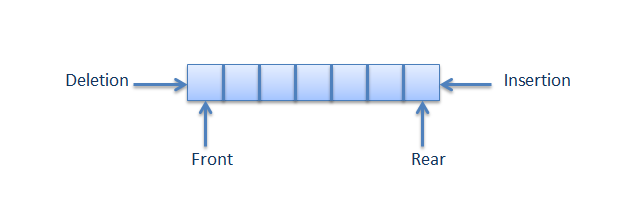

### Sequential Data Structures (**limited access**)

## Stack
* A stack is a common linear data structure.
* Just like it's name, you can think of it as a collection of elements placed on top of one another.
* In order to reach an element at the bottom of the stack you first have to remove the elements that have been places on top of it.
* Both insertion and deletion of elements happens at one end of the collection. This is known as the LIFO, or last in first out.

These methods to remove and add elements are commonly referred to as push and pop (push representing adding, pop representing a removal).

### Implementation
When implementing a stack we need to create two classes, a Stack and a node. The stack class will include all the logic for manipulating the data structure, while the node class will track its assigned value as well as contain a reference to the next element in the stack.

#### MyStack Class
**Attributes**
* The top node in the stack

**Methods**
* push()- Adds a new node on to the stack.
* pop()- Removes the top node from the stack.
* peek()- Returns the top node from the stack but does not remove it.
* isEmpty()- Returns a boolean (True/False) representing if the stack has nodes or not.

#### Node Class
**Attributes**
* The value assigned to the node object.
* The next node in the stack.

**Methods**
* Single arg constructor (for value of the node).
* To string method.

## Queue
* A queue is another linear data structure.
* When we discuss a queue, think of it in the context of people waiting in a line for service.
  * When an individual is attended to, they exit the front of the line.
  * As more people arrive they enter the queue one after another following the individual at the tail end of the line.
* Insertion and deletion happen at opposite ends of the collection. This is known as the FIFO, or first in first out.  

### Implementation
When implementing a queue we need to create two classes, a queue and a node. The queue class will include all the logic for manipulating the data structure, while the node class will track its assigned value as well as contain a reference to the next element in the stack.

#### MyQueue Class
**Attributes**
* Current head node
* Current tail node

**Methods**
* add()- AKA enqueue, adds a new node to the tail of the queue, also known as enqueue.
* remove()- AKA dequeue, removes the node from the head of the queue, also known as dequeue.
* peek()- Returns the head node from the queue but does not remove it.
* isEmpty()- Returns a boolean (True/False) representing if the stack has nodes or not.

#### Node Class
**Attributes**
* The value assigned to the node object.
* The next node in the queue.

**Methods**
* Single arg constructor (for value of the node).
* To string method.
