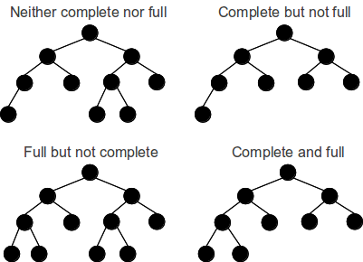

## Trees
* A tree is a data structure that contains a collection of nodes.  
* These nodes can be of any datatype and do not have to be in a particular order.  
* A tree, in the programming sense, always contains a root node. This root node contains 0 or more child nodes, each subsequent child node contains 0 or more child nodes.  
* Nodes without any child nodes are called "leafs".  
* **Depth:** is defined as the number of paths required to get from the root to a specific node.
* **Height:** the height of a tree is the largest depth.

### Binary Tree
* We will be focusing on a subset of trees known as **Binary Trees**. A binary tree is a tree with some constraints on child nodes. With these trees nodes can have up to two children.  

* A binary search tree is a binary tree where the nodes are ordered in a specific order. For every node all left descendants must be less than or equal to the current node, which is less than all right descendants.  

``all left descendants <= n < all right descendants``  

#### Complete and Full Binary trees
* Complete binary trees have all nodes with the exception of the last level of nodes. This last level must be filled from left to right to be considered complete.
* Full trees is a tree where every node has either zero or two children.  

#### Perfect Trees
* A perfect tree is one that is both full and complete. Every level has the maximum number of nodes.

* Perfect trees have (2^k -1) nodes.

### Traversing trees
Using our binary tree as an example lets look at traversal
* Pre-order: Consider a current node before its children.
  * 8, 3, 1, 6, 4, 7, 10, 14, 13
* Post-order: Consider the current node after its children.
  * 1, 4, 7, 6, 3, 13, 14, 10, 8
* In-order: Visit the left branch then the current node, then the right branch
  * 1, 3, 4, 6, 7, 8, 10, 13, 14  
  

## [Binary Search Algorithm](binary_search.md)
